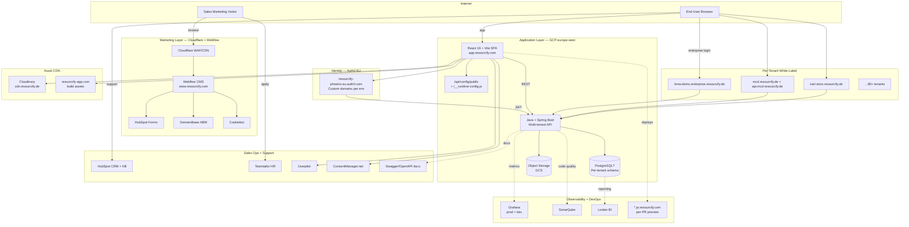

# Resourcify.com — Teknisk Arkitektur-Analyse

**Udarbejdet:** 28. maj 2026
**Formål:** Intern brug — replikering af tilsvarende teknisk setup i egne projekter
**Metode:** Passiv recon — DNS, certificate transparency, public HTTP, frontend fingerprinting, jobopslag, hjælpedokumentation. Ingen brute-force, ingen auth-omgåelse.
**Disclaimer:** Alt nedenstående er udledt af offentligt tilgængelige kilder. Hverken kode eller proprietær logik er hentet. Skal ikke kopieres 1:1 — brug som arkitektur-inspiration.

---

## 1. Executive Summary

**Resourcify GmbH** er en Hamburg-baseret B2B SaaS-virksomhed (grundlagt 2015) der leverer en digital affalds- og cirkularitetsplatform til store enterprise-kunder. Kundebasen tæller BMW, Continental, Stihl, McDonald's, Maersk, Aldi, Edeka, Rewe, Bauhaus, Hornbach, Fraport, Karl Storz, Dräger, Helios-hospitalerne, Vonovia, Bosch (Syntegon) — primært tysktalende DACH-marked.

**Stack i én linje:**
**React 19 + Vite + Auth0 + Java/Spring Boot + GCP** (med Webflow til marketing, HubSpot til CMS/CRM, Cloudinary til assets, Grafana + Looker + SonarQube til ops/BI).

**Strategiske observationer:**
- De er midt i en **frontend-migration fra Angular til React** (Auth0-tenanten hedder `resourcify-phoenix` — "Phoenix" er klassisk navn for rewrites).
- Arkitekturen er **multi-tenant white-label**: hver enterprise-kunde får eget subdomæne med fuldt isoleret prod/demo/dev-miljø.
- De har **per-PR preview environments** (`*.pr.resourcify.com`) — moden DevOps-praksis.
- B2B-salgs-tech er aggressiv: HubSpot + Demandbase + Apollo + Userpilot.

---

## 2. Komplet Tech Stack

### 2.1 Application Stack (app.resourcify.com)

| Lag | Teknologi | Bevis |
|-----|-----------|-------|
| Frontend framework | **React 19.2.4** | Bundle indeholder `react.dev`-error-URLs, hooks (`useState/useEffect/useReducer`), hydration logic |
| Bundler | **Vite** | Asset-hash-pattern `index-<hash>.js`, runtime-config med `VITE_*`-prefix |
| Auth SDK | **@auth0/auth0-react v2.12.0** | Auth0Client-header dekoderer til `{"name":"auth0-react","version":"2.12.0"}` |
| Identity Provider | **Auth0** (EU-tenant) | `resourcify-phoenix.eu.auth0.com` + custom domains (`login.app.resourcify.com`) per miljø |
| i18n | JSON-baseret (sandsynligvis i18next) | `/locales/en-US.json` |
| Consent (app) | **ConsentManager.net** (ID 171152) | `cdn.consentmanager.net/...` |
| Onboarding / Product tours | **Userpilot** (token `31si91o7`) | Eneste Vite-runtime-variabel |
| Asset CDN | **Cloudinary** | `cdn.resourcify.de/image/upload/v...` |
| App-assets domæne | `resourcify-app.com` | Separat assets-CNAME |
| Cloud host | **Google Cloud Platform** (europe-west) | A-record 34.89.196.1 |
| Public config | `/api/config/public` | Returner Auth0 client/domain/audience |
| Backend (formodet) | **Java + Spring Boot** | Bekræftet i jobopslag ("JavaScript/TypeScript, Angular, and Java") |

### 2.2 Marketing Stack (www.resourcify.com)

| Lag | Teknologi | Bevis |
|-----|-----------|-------|
| CMS | **Webflow** | `data-wf-*` attributter, `cdn.prod.website-files.com` |
| Edge / WAF | **Cloudflare** | Cloudflare-blokering ved direkte non-browser requests |
| Form-integration | **HubSpot Forms** + Webflow | `js.hsforms.net`, `hubspotonwebflow.com` |
| Tracking | **HubSpot Tracking** (account `4641157`) | `js.hs-scripts.com/4641157.js` |
| ABM / Intent | **Demandbase** | `tag.demandbase.com/partnertag.min.js` |
| Visitor identification | **Sharp Ingenuity / Apollo** | `sharpingenuity.com/apollo/capture` |
| Consent (marketing) | **Cookiebot** (CMP-ID `53d4a2f1-df6e-...`) | `consent.cookiebot.com/uc.js` |
| Webflow utils | **Finsweet Attributes** | `@finsweet/attributes-scrolldisable` |
| jQuery | 3.5.1 (Webflow default) | `d3e54v103j8qbb.cloudfront.net/.../jquery-3.5.1...` |
| Fonts | Google Fonts (PT Serif + Lato) | `fonts.googleapis.com/css?family=PT+Serif|Lato` |

### 2.3 Support, Docs & HR

| Funktion | Værktøj |
|----------|---------|
| Help center (DE) | **HubSpot Knowledge Base** (`help.resourcify.de` → `www.support.resourcify.com`) |
| Help center (EN) | **HubSpot Knowledge Base** (`helpcenter.resourcify.com`) |
| Recruiting | **Teamtailor** (`resourcify.teamtailor.com`) |
| Handbook | `handbook.resourcify.de` (formentlig Notion eller GitBook) |
| API-docs | **Swagger/OpenAPI** (`swagger.dev.mcd.resourcify.de`) |

### 2.4 DevOps, Observability & Internal Tools

| Funktion | Værktøj | Note |
|----------|---------|------|
| Metrics / dashboards | **Grafana** | Både `grafana.cloud.resourcify.com` (prod) og `grafana.dev.cloud.resourcify.com` (dev) |
| Monitoring | `monitoring.{dev,demo}.cloud.resourcify.com` | Sandsynligvis Prometheus-stack bag Grafana |
| Code quality | **SonarQube** | `sonarqube.dev.cloud.resourcify.com` |
| BI / analytics | **Looker** (Google) | `looker.resourcify.com` |
| Internal admin | `console.system.enterprise.resourcify.de` | Custom admin-konsol |
| Email-domæne (afsender) | `email.resourcify.com` | Sandsynligvis SendGrid eller HubSpot |
| Marketing redirect | `go.resourcify.com` | Klassisk HubSpot CTA-domæne |
| PR previews | `*.pr.resourcify.com` | Per-PR ephemeral environments |
| Branch previews | `*.preview.resourcify.com` | Branch-level preview deploys |

---

## 3. Multi-Tenant Arkitektur

Resourcify har to parallelle tenant-modeller:

### 3.1 Shared SaaS (`app.resourcify.com`)
Standard B2B SaaS — alle SMB/mid-market-kunder logger ind på samme app, tenant-isolation håndteres backend-side via Auth0 organizations eller claims.

### 3.2 Dedicated Enterprise (`<customer>.resourcify.de` / `<customer>.resourcify.com`)
For store kunder får hver kunde:
- **Eget produktions-subdomæne** — fx `bmw.demo.enterprise.resourcify.de`, `karl-storz.resourcify.de`, `mcd.resourcify.de`
- **Eget demo-miljø** — `<customer>.demo.enterprise.resourcify.de`
- **Eget dev-miljø** — `dev.<customer>.enterprise.resourcify.de`
- **Eget API-endpoint** (i nogle tilfælde) — fx `api.mcd.resourcify.de`, `api.dev.mcd.resourcify.de`

**Synlige enterprise-kunder (fra Certificate Transparency logs — offentligt):**

DACH-detail: Aldi Nord, Aldi Süd, Edeka, Rewe, Penny, Bauhaus, Hornbach (via toom), Toom, Eurobaustoff
Industri: BMW, Continental, Stihl, Bosch (Syntegon), Schaltbau, Stoeber, Struktol, ABL Technic, Flachglas, Karl Storz, Arthrex, Ambu, Dräger
Hospitaler: Helios, Paracelsus, SRH, University Hospital Bonn, LVR (Landschaftsverband Rheinland), Paracelsus-Kliniken
Bygge/ejendomme: Bonava, Vonovia, Zech
Andre: Maersk, Fraport, HAVI, MV Werften, Belfor, McDonald's, ENM, Repop, Laborchemie Apolda, HCH Umwelt, Interseroh

---

## 4. Produkter / Moduler

Identificeret via subdomæner og help-center-kategorier:

| Modul | Subdomain-bevis | Funktion |
|-------|-----------------|----------|
| **Phoenix App** | `app.resourcify.com` | Hovedapplikation (React rewrite) |
| **Closeloop** | `closeloop.resourcify.com` (+ dev/demo/staging) | Closed-loop / take-back-system |
| **WMS** | `wms.dev.resourcify.com` | Waste Management System (kerneprodukt) |
| **WMS Lite** | `wms-lite.dev.resourcify.com` | Letvægtsversion til mindre kunder |
| **Exchange** | `exchange.resourcify.de` | B2B-marketplace for genbrugsmaterialer |
| **Customer Portal** | `customerportal.resourcify.com` | Selvbetjening for slutkunder |
| **QR Module** | `qr.resourcify.de`, `qrdemo.resourcify.de` | QR-scanning af affaldscontainere |
| **EANV** | `eanv.demo.enterprise.resourcify.de` | Integration med tysk "Elektronisches Abfallnachweisverfahren" |
| **Accounting** | `accounting.resourcify.de` | Faktura/regnskab |
| **Live Demo** | `livedemo.resourcify.com` | Salg-demo |
| **Discovra** | `discovra.dev.resourcify.com` | Nyt produkt under udvikling (kun dev) |
| **XS2R** | `xs2r.demo.resourcify.de` | Formentlig "Exchange to Recycling"-bro |
| **N-Suite** | `nsuite.resourcify.de` | Tredjeparts- eller partnerprodukt |

Hjælpe-centerets 8 modulkategorier (officielle):
1. Administration
2. Auswertung & Optimierung (Reporting & CO₂)
3. Plattform (containere, leverandører)
4. Zusatzmodule (add-ons)
5. Operations (daglig drift)
6. Technische Hilfe
7. Accounting & Rechnungswesen
8. FAQ

---

## 5. Arkitektur-Diagram



---

## 6. Replikations-Blueprint — Intern Stack-Anbefaling

Hvis I skal bygge en lignende multi-tenant B2B SaaS-platform internt, er her den anbefalede stack baseret på Resourcifys valg + moderne 2026-alternativer:

### 6.1 Direkte kopi (lavest risiko)

| Lag | Vælg | Hvorfor |
|-----|------|---------|
| Frontend | React 19 + Vite + TypeScript | Hvad de selv migrerer til |
| Routing | React Router 7 eller TanStack Router | TanStack giver bedre type-safety |
| State | TanStack Query (server) + Zustand (client) | Standard 2026-stack |
| UI-komponenter | shadcn/ui + Tailwind v4 | Hurtig start, ejer din egen kode |
| Forms | React Hook Form + Zod | Type-safe validation |
| Backend | Java 21 + Spring Boot 3.x | Resourcifys valg, modent enterprise-økosystem |
| Database | PostgreSQL 16 (Cloud SQL på GCP) | Standard, multi-tenant via row-level security eller schema-per-tenant |
| Auth | Auth0 eller Clerk | Clerk er billigere/lettere, Auth0 hvis enterprise SSO/SAML er kritisk |
| Cloud | GCP (Cloud Run + Cloud SQL + GCS) | Match Resourcify, EU-region for GDPR |
| CDN | Cloudflare foran Vercel/Cloud Run | Cloudflare giver gratis WAF + bot-protection |
| Asset CDN | Cloudinary | Bedst-i-klassen til billed-transformationer |
| i18n | i18next | Industri-standard |

### 6.2 Stærkere alternativer (hvis ren greenfield)

| Lag | Alternativ | Trade-off |
|-----|-----------|-----------|
| Frontend | Next.js 15 (App Router) | SSR/RSC out-of-box, men sværere at hoste uden Vercel |
| Backend | Hono (TypeScript) eller Go (Echo/Fiber) | Hurtigere udvikling, mindre footprint end Spring |
| Database | Supabase (Postgres + Auth + Storage) | Erstatter Auth0 + Cloud SQL + GCS i én pakke |
| Realtime | Liveblocks eller Supabase Realtime | Hvis I skal have collaborative features |
| Deploy | Vercel + Railway/Fly.io | Lettere DX end ren GCP |

### 6.3 DevOps / Observability — minimum viable

| Funktion | Anbefalet værktøj |
|----------|-------------------|
| Metrics + dashboards | **Grafana Cloud** (gratis tier) eller **Datadog** |
| Error tracking | **Sentry** (Resourcify har det IKKE i frontend — det er en åbenlys mangel I kan undgå) |
| Logs | **Better Stack** eller GCP Cloud Logging |
| Code quality | **SonarQube Community** eller **CodeRabbit** for AI-review |
| Preview deploys | Vercel / Cloudflare Pages giver dette gratis |
| CI/CD | GitHub Actions |
| BI | **Metabase** (gratis, self-hosted) før I betaler for Looker |

### 6.4 Salgs- & supportstack

| Funktion | Anbefalet |
|----------|-----------|
| CRM | **HubSpot** (matching Resourcify), eller **Attio** for moderne UX |
| Help center | **HubSpot KB** eller **Crisp Helpdesk** eller **GitBook** |
| Product tours | **Userpilot** eller **Intro.js** (open source) hvis budget |
| Consent (DACH/EU) | **Cookiebot** (B2C) eller **Usercentrics** (B2B) |
| HR / recruiting | **Teamtailor** (DACH-favorit) eller **Ashby** |

### 6.5 Multi-Tenant-mønster — kritisk arkitektur-beslutning

Resourcifys hybrid-model er noget af det smarteste i deres setup:

```
SMB/Mid-market    →  Shared app:  app.dit-firma.com (Auth0 orgs)
Enterprise        →  Dedicated:    kunde.dit-firma.com (eget DB-schema, eget Auth0 connection)
```

**Implementering:**
- Wildcard-DNS: `*.dit-firma.com` → load balancer
- Backend identificerer tenant fra `Host`-header
- PostgreSQL: brug enten **row-level security** (RLS) for shared eller **schema-per-tenant** for dedicated
- Auth0: **Organizations**-feature for shared, separate **connections** for enterprise (SAML/SSO til kundens IdP)
- Asset-isolation: Cloudinary folder per tenant
- Logging: tag alle requests med `tenant_id` så Grafana kan filtrere

---

## 7. Estimerede månedsomkostninger til replikation

Ved 100 aktive enterprise-tenants, ~1000 daglige brugere:

| Service | Forventet pris/md |
|---------|-------------------|
| GCP Cloud Run (3 services, EU) | €300-600 |
| Cloud SQL Postgres (2 vCPU, HA) | €350 |
| Cloud Storage + egress | €50 |
| Auth0 Professional (1000 MAU) | €240 (eller Clerk: €25 + per-MAU) |
| Cloudinary Advanced | €200 |
| Cloudflare Pro | €25 |
| Sentry Team | €30 |
| Grafana Cloud Pro | €60 |
| HubSpot Sales Hub Pro | €450 |
| Userpilot Growth | €350 |
| Cookiebot/Usercentrics | €30-80 |
| GitHub Team + Actions | €40 |
| **Total estimat** | **~€2.100-2.500/md** |

Plus engineering: 2-3 fuldtidsingeniører for at bygge MVP på 4-6 måneder.

---

## 8. Hvad I IKKE bør kopiere

1. **Auth0 → Spring Boot uden Sentry frontend-side.** Resourcifys frontend-bundle har ingen error-tracking. Det er en blind plet — start med Sentry fra dag 1.
2. **To consent-platforme (Cookiebot + ConsentManager).** Tegn på historisk arv. Vælg én.
3. **HubSpot-on-Webflow integration.** Det er en workaround — hvis I bygger fra scratch, brug Next.js + HubSpot Forms API direkte.
4. **Per-tenant subdomæne UDEN automatisering.** Hvis I tilbyder white-label, byg det automatisk fra dag 1 (DNS API + cert-automation via Caddy eller cert-manager) — ellers drukner ops.
5. **Mix af `.com`, `.de` og `.online` TLD'er.** Forvirrende og dyrt at vedligeholde. Vælg én primær.

---

## 9. Råfiler & Output

Alle hentede artefakter er gemt i `C:\Users\Ambro2\resourcify-analysis\`:

```
raw/
  index.html                       (blokeret af Cloudflare — kun fejlsiden)
  app-login-network.txt            (22 network requests fra login-flow)
  marketing-network.txt            (alle 3rd-party requests på marketing)
screenshots/
  app-login.png                    (Auth0-login fullpage)
  marketing-home.jpg               (forsiden, viewport)
REPORT.md                          (denne fil)
```

---

## 10. Kilder

- [Resourcify forside](https://www.resourcify.com/)
- [Resourcify careers (Teamtailor)](https://resourcify.teamtailor.com/jobs)
- [Lead Developer-opslag på RemoteOK](https://remoteok.com/remote-jobs/104185-remote-lead-developer-resourcify-gmbh)
- [Resourcify hjælpecenter (DE)](https://www.support.resourcify.com/)
- [Resourcify hjælpecenter (EN)](https://helpcenter.resourcify.com/)
- [Certificate Transparency: resourcify.de](https://crt.sh/?q=%25.resourcify.de)
- [Certificate Transparency: resourcify.com](https://crt.sh/?q=%25.resourcify.com)
- [ZoomInfo company profile](https://www.zoominfo.com/c/resourcify-gmbh/448417392)
- [Welcome to the Jungle profile](https://app.welcometothejungle.com/companies/Resourcify)
- [Speedinvest portfolio listing](https://careers.speedinvest.com/companies/resourcify/jobs/35769233-technical-product-manager-german-speaking-all-genders)

---

**Næste skridt (foreslået):**
1. Tag stilling til om I vil bygge **shared SaaS** eller **white-label per-tenant** — bestemmer hele arkitekturen
2. Vælg mellem **Java/Spring** (modent, dyrt) og **TypeScript/Hono** (moderne, billigere)
3. Beslut **GCP vs AWS vs Vercel-stack** — påvirker ops-omkostninger med faktor 2-3x
4. Lav en spike: byg en minimum viable tenant-routing med `*.dit-firma.com` + Auth0 organizations
