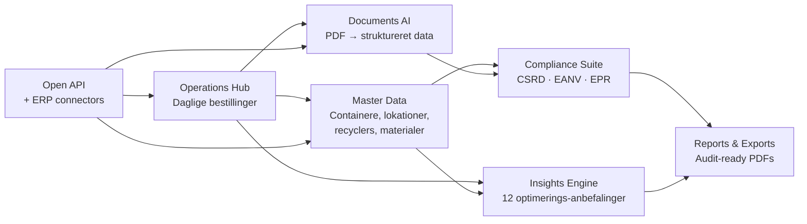
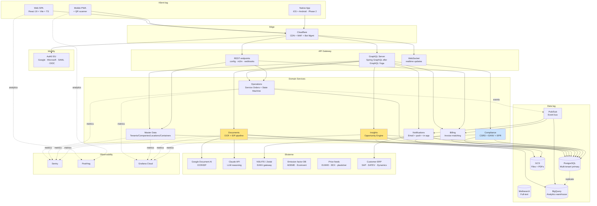
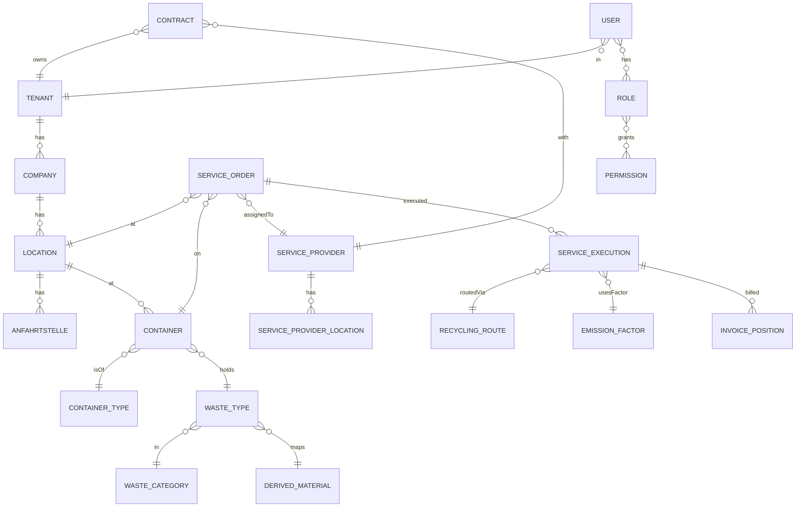

# Indholdsfortegnelse

1. Executive Summary
2. Markedssituationen og mulighed
3. Vores løsningskoncept
4. Arkitektur i overblik
5. Funktionelt landskab
6. Teknisk opbygning
7. Outcomes — hvad platformen leverer
8. Differentiering — vores wedges
9. Build-roadmap — 12 ugers MVP
10. Drift, omkostninger og enheds-økonomi
11. Risici og mitigering
12. Anbefalede næste skridt

---

# 1. Executive Summary

## Konteksten

EU's CSRD- og ESPR-lovgivning tvinger fra 2024-2027 omkring **50.000 europæiske virksomheder** til at rapportere på affald, materialestrømme og CO₂-emissioner fra deres operationer. Samtidig er kommerciel affaldshåndtering en €100+ mia. industri, der stadig domineres af manuelle processer, PDF-fakturaer og e-mail-koordinering.

**Resourcify** (Hamburg, grundlagt 2015) har på 8 år bygget en B2B SaaS-platform der digitaliserer denne værdikæde for store kunder som BMW, McDonald's, Hornbach, Bosch, Maersk og Johnson & Johnson. De har rejst **€23M total** (€14M Series A i Sep 2023 ledet af Vorwerk Ventures), styrer **€100M+ affald** på platformen, og driver en two-sided marketplace med **800+ recyclers i 19+ lande**.

## Vores tese

Resourcify har valideret markedet — men deres tech-stack er ikke deres moat. Deres reelle barriere er:

1. Et 8-årigt recycler-netværk
2. Compliance-ekspertise (CSRD, EANV, EPR)
3. Enterprise sales-cyklusser (6-12 mdr)

Vi kan vinde mod dem ved at angribe **én vertical (healthcare) med dybere compliance, bedre AI, og en åben API-strategi** — bygget på en moderne, modulær arkitektur der koster ⅓ af deres legacy-investering at opnå.

## Hvad denne drejebog leverer

Et fuldt udspecificeret koncept til at bygge en konkurrerende cirkulær-økonomi-platform, inklusive arkitekturvalg, feature-prioritering, build-roadmap, omkostningsmodel og go-to-market-strategi. Designet til at kunne kickes off med et 2-3 personers team og en initial investering på **~€86k** (MVP) plus **~€340k år 1 GTM**.

---

# 2. Markedssituationen og mulighed

## 2.1 Marked og drivere

| Driver | Beskrivelse | Tidshorisont |
|--------|-------------|--------------|
| **CSRD (EU)** | 50.000+ virksomheder skal rapportere ESG, inkl. ESRS E5 (Resource Use & Circular Economy) | Ikraft 2024-2027 |
| **EPR-udvidelser** | Extended Producer Responsibility for tekstiler, batterier, byggemat. | 2025-2028 |
| **Right-to-Repair** | EU's RTR-direktiv kræver dokumentation af komponentstrømme | 2025+ |
| **ESPR / Digital Product Passport** | Hvert produkt får digital pasport med materialesammensætning | 2027+ |
| **Tysk EANV** | E-affaldsregister er obligatorisk for farligt affald (kr. signatur) | Allerede ikraft |
| **CRMA (Critical Raw Materials Act)** | Krav om genvunden andel i kritiske materialer | 2030 |

## 2.2 Kunde-segmentering

Tre primære buyer-segmenter, ranked efter tilgængelighed:

**Segment A: Manufacturing & Industri** (BMW, Continental, Bosch, Stihl)
- ACV: €100-200k, sales-cyklus 9-12 mdr
- Pain: CSRD-rapportering, Scope 3 emissioner, omkostnings-optimering
- Beslutter: Head of Sustainability + CFO

**Segment B: Healthcare & Pharma** (Helios, Karl Storz, J&J, Dräger) — **VORES MÅL**
- ACV: €80-150k, sales-cyklus 6-9 mdr
- Pain: Medicinsk affald-compliance, MDR-traceability, sterile container management
- Beslutter: Head of Compliance + Head of Operations
- **Hvorfor vinder vi her:** Resourcify behandler healthcare som "bare en vertikal". Vi bygger healthcare-først.

**Segment C: Retail & Hospitality** (McDonald's, Hornbach, REWE, Five Guys)
- ACV: €50-100k, mange lokationer, sales-cyklus 6 mdr
- Pain: Multi-site rollout, lokal compliance variance
- Beslutter: Head of Operations + Sustainability

## 2.3 Hvorfor nu

- **Investorer er aktive** i circular economy SaaS — Vorwerk, Speedinvest, Revent, Ananda, BonVenture er alle aktive
- **Compliance-pres stiger eksponentielt** med CSRD ramp-up 2026-2027
- **AI/IDP-teknologi** (Document AI, Claude Vision) er nu billig nok til at automatisere processer der før krævede 3 FTE'er
- **Markedet konsoliderer ikke endnu** — der er plads til 3-5 europæiske vindere, kun 1-2 er identificeret indtil videre (Resourcify, Seenons)

---

# 3. Vores løsningskoncept

## 3.1 Vision

> En åben cirkulær økonomi-platform der gør det trivielt for enhver mellemstor og stor virksomhed at: (1) **se** alle deres affaldsstrømme i realtid, (2) **dokumentere** compliance automatisk, (3) **optimere** med AI for omkostning og CO₂-impact, og (4) **integrere** med deres eksisterende ERP/regnskab uden manuelt arbejde.

## 3.2 Kernekoncept i 5 sætninger

1. Hver kunde får én platform der samler alle deres affaldsdata fra alle deres lokationer
2. Platformen integrerer ind- og udgående med deres recyclers, ERP-systemer, og myndigheds-portaler
3. AI læser PDF-fakturaer og vejebons automatisk, så ingen manuelt skal indtaste data
4. Insights-motoren peger på 12+ konkrete besparelsesmuligheder med årlig €-værdi
5. CSRD/EANV-compliance genereres som ét klik, audit-ready

## 3.3 Hovedmoduler (slutbruger-perspektiv)



| Modul | Slutbruger-værdi |
|-------|------------------|
| **Operations Hub** | Operator bestiller/aflyser/registrerer pickups på 30 sekunder per ordre |
| **Master Data** | IT/admin opretter ny lokation, recycler, container-type uden support-ticket |
| **Documents AI** | Finance smider PDF-faktura ind — data extracts automatisk, matches mod ordre |
| **Compliance Suite** | ESG-leder klikker "Generate CSRD report" og får audit-klar PDF |
| **Insights Engine** | CFO ser "spar €127.000/år ved at skifte recycler i 3 lokationer" |
| **Reports & Exports** | Hver afdeling henter sin egen Excel/PDF uden at spørge IT |
| **Open API** | Kundens ERP-team integrerer på 1 uge, ikke 1 kvartal |

---

# 4. Arkitektur i overblik

## 4.1 Arkitektur-principper

1. **Multi-tenant fra dag 1** — alle features skal være tenant-aware uden eftertænkning
2. **API-first** — alle UI-actions er bygget på den samme GraphQL+REST API som kunder kan kalde direkte
3. **Modulær monolitisk** — startpunkt er én Spring Boot/Node-app, ikke microservices. Splittes når ≥30 ingeniører
4. **Event-driven kerne** — alle state-ændringer udsender events; integrationer abonnerer
5. **Compliance by design** — audit log på alt, GDPR-export på 1 klik, RBAC scoped per location
6. **Mobile-first PWA + native** — operator-UI skal virke på en tablet i en lagerhal
7. **Edge-deployment** — global users via Cloudflare; backend i EU for GDPR

## 4.2 Lag-arkitektur



## 4.3 Multi-tenant model

**Hybrid model — to deployment-mønstre:**

| Tier | Mønster | Kundetype | Pris |
|------|---------|-----------|------|
| **Starter** | Shared SaaS på `app.dit-firma.com`, RLS i Postgres | SMB op til 5 lokationer | €499/md + bruger |
| **Business** | Shared SaaS, dedicated DB-schema, custom branding | Mid-market 5-50 lokationer | €1.499/md + bruger |
| **Enterprise** | Dedicated subdomain `<kunde>.dit-firma.com`, isoleret DB-schema, dedicated Auth0 connection, custom integrations | 50+ lokationer eller compliance-tunge | €80-150k ACV |

**Implementation:**
- Wildcard DNS: `*.dit-firma.com` → Cloud Run / Kubernetes Ingress
- Backend identificerer tenant fra `Host`-header → injicerer i alle GraphQL contexts
- Postgres: enkel RLS for shared, schema-per-tenant for Enterprise
- Auth0 Organizations for shared; separate connections for Enterprise (kundens IdP)

## 4.4 Miljø-strategi

| Miljø | Domain-pattern | Formål |
|-------|----------------|--------|
| Production | `app.dit-firma.com`, `<kunde>.dit-firma.com` | Live brugere |
| Staging | `app.staging.dit-firma.com` | Pre-prod test |
| Development | `app.dev.dit-firma.com` | Dev integration |
| Per-PR preview | `*.pr.dit-firma.com` | Hver pull request får eget miljø |
| Sales demo | `livedemo.dit-firma.com` | Salgsteam demos |

---

# 5. Funktionelt landskab

Følgende er det komplette feature-katalog vi bygger. Ordnet efter prioritet (P0 = MVP, P1 = post-MVP, P2 = roadmap).

## 5.1 Master Data Management — P0

| Feature | Beskrivelse |
|---------|-------------|
| Tenant + Company hierarki | Mandant → Company → Standort → Anfahrtstelle |
| Cross-cutting dimensions | Kostenstellen, profit-center, custom tags |
| Container-typer | 15+ kategorier (ROLL_OFF, SKIP, BIG_BAG, HAZARDOUS, ...) |
| Waste-typer (AVV) | Komplet EU AVV-katalog (Abfallverzeichnis-Verordnung) |
| Materialer | 11 hovedkategorier (Plastic, Metal, Paper, Wood, Glass, Electronic, Medical, ...) |
| Disposal paths | RECYCLING, THERMAL_RECOVERY, INCINERATION_*, LANDFILL, REUSE |
| Recyclers (service providers) | Master record + locations + contracts |
| Merge-operations | Konsolider dubletter (locations, companies, waste-types) |
| Excel bulk-IO | Export → edit → import for alle master-objekter |

## 5.2 Operations Flow — P0

| Feature | Beskrivelse |
|---------|-------------|
| Standortübersicht | Tablet-friendly per-location overview |
| Order state machine | 9 states: Beauftragt → Bestätigt → Ausgeführt → Zurückgemeldet → Geprüft → Bereit zur Abrechnung → In Abrechnung → Abgerechnet (+ Storniert) |
| Order types | Gestellung, Leerung, Tausch, Abholung |
| Scheduling modes | "Auf Abruf" (on-demand) + "Intervall" (auto-create 6 dage før) |
| Mehrmengen | Overflow quantities tracking |
| Nachträgliche Erfassung | Retroactive order entry |
| Provider notification | Email + ERP integration, per-provider routing rules |
| Inbound mailbox | IMAP-baseret, auto-link to orders |
| QR workflow | ≤10 QR-koder pr. PDF batch → mobile-scan → ordering |
| Provider switch | Wechsel mellem recyclers med historik-bevarelse |

## 5.3 Documents AI / IDP — P0 (vores wedge)

| Feature | Beskrivelse |
|---------|-------------|
| Drag-and-drop PDF upload | Batch upload, drag fra mail |
| OCR + entity extraction | Vægt, antal, dato, container, AVV-kode, beløb |
| Confidence scoring | Auto-godkend over threshold, manual review under |
| Auto-link til ServiceOrder | Heuristik: location + container + date + vægt |
| Feedback loop | User corrections → træningsdata → månedlig re-træning |
| Multi-format support | PDF, JPG, scan, DOC, email-attachment |
| Provider-template library | Lær vejebon-templates pr. recycler |
| **Backup engine: Claude Vision** | Zero-shot fallback for ukendte templates |

## 5.4 Insights Engine — P1

12 specifikke optimerings-anbefalinger, hver med årlig €-værdi og CO₂-impact:

| Anbefalingstype | Kategori | Eksempel |
|-----------------|----------|----------|
| Container efficiency | Savings | "Skift fra 1100L til 770L på lokation X — spar €4.200/år" |
| Price benchmarking | Benchmarking | "Match alle lokationer til din bedste interne pris" |
| Recycler comparison | Benchmarking | "Skift volumen til billigste recycler per materiale" |
| Recycling pathway upgrades | Circularity | "Opgrader streams til højere-værdi genbrugsruter" |
| Sorting improvement | Circularity | "Reducer mixed waste via bedre kildesortering" |
| Waste overproduction | Circularity | "Lokationer over peer-median — sandsynlige overforbrugere" |
| Circular economy programs | Circularity | "Tilmeld certificerede programmer matching dine streams" |
| Equipment right-sizing | Savings | "Downsize compactors/presses under threshold use" |
| Service contract review | Savings | "Audit kontraktvilkår mod markedsrater" |
| Pickup window optimization | Savings | "Cluster pickups på tværs af sites — reducer trips" |
| Compactor density tuning | Savings | "Forøg kompressionsforhold på under-tunede enheder" |
| Hauler fee audit | Savings | "Audit accessoriske gebyrer mod kontrakts-prisliste" |

**Differentiator vs Resourcify:** Vi tilbyder **synthetic benchmark fra dag 1** baseret på branchen-aggregeret data — Resourcify kræver 4-6 ugers data warm-up.

## 5.5 Compliance Suite — P0/P1

| Sub-modul | Beskrivelse | Prio |
|-----------|-------------|------|
| **CSRD report generator** | One-click ESRS E5 audit-klar PDF | P0 |
| **Scope 3 Cat. 5 export** | GHG Protocol aligned, mass × factor | P0 |
| **EANV / ZKS-Abfall** | Via NSUITE eller Zedal partnership | P0 |
| **Cloud QES** | eIDAS-cloud QES via D-TRUST/Bundesdruckerei | P1 (wedge) |
| **EPR-rapportering** | Per-land variant af Extended Producer Responsibility | P1 |
| **MDR-traceability** | Medical Device Reverse Logistics | P1 (healthcare wedge) |
| **DPP-integration** | Digital Product Passport hooks | P2 |
| **Audit log eksport** | Komplet trail med 7-årig retention | P0 |

## 5.6 Reporting & Analytics — P0/P1

| Feature | Prio |
|---------|------|
| Home Dashboard (KPI cards) | P0 |
| Operations Dashboard (realtime KPIs) | P0 |
| Cost dashboards (over-time, heatmap, per-location) | P0 |
| Recycling rate dashboards | P0 |
| Separation rate dashboards | P0 |
| Material analysis (boxplots) | P1 |
| Location benchmarking | P1 |
| CSRD Materials Breakdown | P0 |
| CO₂ emission report | P0 |
| Top performance ranking | P1 |
| Excel/PDF/CSV export everywhere | P0 |

**Standard KPI-bibliotek:** Recyclingquote, Getrenntsammlungsquote, Rückmeldequote, Problemquote, Pünktliche Abholquote, Auftragsausführungsquote.

## 5.7 Compliance-rolemodel — P0

```
Roller:
  - SUPER_ADMIN (cross-tenant, kun internt support)
  - TENANT_ADMIN (alt indenfor tenant)
  - LOCATION_ADMIN (scope: locations)
  - OPERATOR (scope: location + ordre-create/edit)
  - VIEWER (read-only, scoped)
  - AUDITOR (read-only på compliance + reports)

Scopes:
  - tenant (alt)
  - company
  - location (single eller list)
  - anfahrtstelle

MFA påkrævet for: TENANT_ADMIN, AUDITOR
SSO: Google · Microsoft Entra · OIDC · SAML
WebAuthn baseline support fra dag 1
```

## 5.8 Open API & Integrations — P1 (vores wedge)

| Feature | Beskrivelse |
|---------|-------------|
| Public GraphQL API | Live API explorer (Stoplight eller GraphiQL) |
| REST endpoints | Subset for legacy ERP-integration |
| Webhook engine | 20+ event-typer (order.created, invoice.matched, etc.) |
| M2M API-keys | Per-tenant management UI |
| Pre-built ERP connectors | SAP, DATEV, Dynamics, NetSuite, Lexware, Xero |
| Zapier / Make / n8n apps | Public connector i marketplace |
| OpenAPI spec + SDK | Auto-genereret npm + pip + .NET pakker |
| Rate limiting | Per-key, per-IP, fair-use defaults |

## 5.9 Mobile & PWA — P0/P1

| Feature | Prio |
|---------|------|
| PWA med Service Worker | P0 |
| Offline cache for Standortübersicht | P0 |
| Native camera API for QR scanning | P0 |
| Push notifications | P1 |
| Native iOS app (React Native eller Expo) | P1 (wedge — Resourcify har ingen) |
| Native Android app | P1 |

---

# 6. Teknisk opbygning

## 6.1 Tech-stack — anbefalet

### Frontend
| Lag | Valg | Begrundelse |
|-----|------|-------------|
| Framework | React 19 | Industri-standard, samme som Resourcify |
| Bundler | Vite | Hurtigste DX, samme valg som Resourcify |
| Sprog | TypeScript | Type-safety kritisk for kompleks domænemodel |
| Routing | React Router 7 eller TanStack Router | TanStack giver fuld type-safety på routes |
| State | TanStack Query + Zustand | Server-state + minimal client-state |
| Validation | Zod | Single source of truth shared client+server |
| UI | shadcn/ui + Tailwind v4 + Radix | Ejet kode, ingen vendor-lock |
| Charts | Recharts + D3 | Samme som Resourcify, modent |
| Tables | TanStack Table | Headless, fleksibel |
| Forms | React Hook Form + Zod | Performance + DX |
| i18n | i18next | DE + EN + EU-sprog senere |
| Rich text | Tiptap | Modernere end Slate |
| PDF | jsPDF | Client-side preview |
| Excel | xlsx (SheetJS) | Bulk I/O standard |

### Backend
| Lag | Valg | Alternativ |
|-----|------|-----------|
| Sprog | **TypeScript (Node 22)** | Java (Spring Boot 3.x) hvis enterprise team |
| Framework | Hono eller NestJS | Spring Boot for Java-vejen |
| GraphQL | GraphQL Yoga + Pothos | Spring GraphQL for Java |
| Database | PostgreSQL 16 | — |
| ORM | Drizzle eller Prisma | Spring Data JPA / Hibernate for Java |
| Migrations | Drizzle Kit | Flyway for Java |
| Cache | Redis (Cloud Memorystore) | — |
| Queue | Google Pub/Sub eller BullMQ | Spring Cloud Stream for Java |
| Job scheduler | BullMQ eller Temporal | Spring Batch for Java |
| Search | Meilisearch | Elasticsearch hvis budget |

**Anbefaling:** Start med **TypeScript end-to-end** for hastighed og team-flexibility. Java giver ingen reel fordel for et nyt team, kun overhead.

### Infrastruktur
| Lag | Valg |
|-----|------|
| Cloud | Google Cloud Platform, europe-west3 (Frankfurt) for GDPR |
| Compute | Cloud Run (containerized, autoscale) |
| Database | Cloud SQL Postgres med HA |
| Storage | Google Cloud Storage |
| Edge | Cloudflare (WAF, CDN, Bot Management) |
| Secrets | Google Secret Manager |
| CI/CD | GitHub Actions + Cloud Build |
| IaC | Terraform |

### Auth & Identity
| Lag | Valg |
|-----|------|
| Identity Provider | Auth0 EU (Professional plan) |
| SDK | @auth0/auth0-react |
| MFA | TOTP + WebAuthn fra dag 1 |
| Enterprise SSO | Google, Microsoft Entra, generic OIDC, SAML |

### Observability
| Værktøj | Funktion |
|---------|----------|
| Sentry | Errors (frontend + backend) |
| PostHog | Product analytics + feature flags |
| Grafana Cloud | Metrics + logs + traces |
| Hotjar eller LogRocket | Session replay (Hotjar billigere) |
| Userpilot eller Intro.js | In-app onboarding |
| Crisp | Live chat support |

### AI / Document Processing
| Værktøj | Funktion |
|---------|----------|
| Google Document AI | Custom-trained extractors for vejebons + fakturaer |
| Anthropic Claude API | Zero-shot fallback + LLM-reasoning for insights |
| OpenAI Whisper | Voice-notes for operators (fremtidig) |

### Compliance partnerships
| Partner | Hvad |
|---------|------|
| NSUITE eller Zedal | EANV / ZKS-Abfall gateway |
| ADEME, Ecoinvent | CO₂-faktor databaser |
| D-TRUST eller Bundesdruckerei | Cloud QES |
| TÜV eller DNV | ISO 14064 verifikation (år 2) |

## 6.2 Data-model — kerne-entiteter



## 6.3 GraphQL operations — minimum surface

Vi skal som minimum bygge følgende 60+ operations (mirror Resourcify):

**Lookups (autocomplete):** LookupCompanies, LookupLocations, LookupContainerTypes, LookupWasteTypes, LookupServiceOrders, LookupWasteCatalog (+ admin-varianter)

**CRUD pr. entity:** Get*, List*, Create*, Update*, Delete*, Merge* for Company, Location, ContainerType, WasteType

**Service orders:** GetServiceOrder, GetServiceOrdersList, UpdateServiceOrder, UpdateServiceExecution, DeleteServiceOrders

**Contracts:** GetContract, GetContracts, UpsertContract

**Dashboards:** HomeDashboardKpis, HomeDashboardCircularityReport, HomeDashboardRecyclingRate, TopPerformance, RecyclingRateOverTime, CostOverTime, CostHeatmap, CostPerLocationTable, WasteVolumeProgression, WasteBalanceTable, SeparationRate*

**Compliance:** CsrdMaterialsBreakdown, CsrdReportTable, OperationsServicesAtLocation, SetEmissionFactors, SetDisposalPathAllocations

**Admin:** AvailableRoles, AvailablePermissions, CreateSystemRole, UpdateSystemRole, DeleteSystemRole, GetTenant, UpdateTenantSettings

## 6.4 Sikkerhed & Compliance — baseline

- **MFA** påkrævet for admin roles fra dag 1
- **WebAuthn** for passwordless option
- **GDPR:** Data Export, Right to Erasure, Data Processing Addendum-template på 1 klik
- **SOC 2 readiness:** Audit log, access reviews, change management process fra start
- **ISO 27001 roadmap:** År 2 mål
- **Pen-testing:** Q2 efter MVP
- **Bug bounty:** Phase 2 via HackerOne

## 6.5 DevOps & Quality

| Praksis | Værktøj |
|---------|---------|
| CI/CD | GitHub Actions |
| Per-PR previews | Cloud Run revisions med wildcard DNS |
| Code review gates | CodeRabbit AI + 1 human reviewer |
| Code quality | SonarCloud (gratis for OSS, eller SonarQube Community) |
| Type checking | tsc strict, eslint, prettier |
| Tests | Vitest (unit), Playwright (e2e), supertest (API) |
| Coverage gate | 70% min på domain services |
| Dependency security | Renovate + Snyk |

---

# 7. Outcomes — hvad platformen leverer

## 7.1 For slutkunden

| Outcome | Målbar effekt |
|---------|---------------|
| **Tidsbesparelse på affaldshåndtering** | 60-70% (matching Resourcifys Syntegon-case) |
| **Omkostningsbesparelse** | 15-30% af samlet affaldsudgift |
| **CO₂-reduktion** | 20-40% via bedre genbrugsruter |
| **Compliance-tid** | 1 dag → 1 time for CSRD-rapportering |
| **Operator-fejl** | 80% reduktion via AI-validation |
| **Time-to-onboard ny lokation** | 2 uger → 2 dage |

## 7.2 For os (forretning)

| Metric | Mål år 1 | Mål år 2 | Mål år 3 |
|--------|----------|----------|----------|
| Antal kunder | 5 | 20 | 50 |
| Total ARR | €400k | €2M | €5M |
| Median ACV | €80k | €100k | €100k |
| Net retention | 100% | 110% | 120% |
| Gross margin | 75% | 80% | 85% |
| Team size | 4 | 12 | 25 |
| Cash runway | 18 mdr | 18 mdr | 18 mdr |
| Series A target | — | — | €10-15M @ 5-7x ARR |

## 7.3 Strategiske outcomes

- Etableret som **healthcare circular SaaS leader** i DACH efter år 2
- 3-5 publicerede case studies hos top-tier healthcare-mærker
- ISO 14064 verifikation gennemført ultimo år 2 — sikrer enterprise-credibility
- Open API + 5+ ERP-connectors live ved slutningen af år 2
- Anerkendt brand i 2-3 EU circular-economy events (IFAT, ESG-konferencer)

---

# 8. Differentiering — vores wedges

Resourcify har valideret markedet og vist hvad der virker. Vi vinder ved at angribe deres specifikke svagheder. Tre wedges, prioriteret:

## Wedge 1: Healthcare-first vertikal

**Hvorfor virker det:**
- Resourcify har 8+ healthcare-kunder men intet dedikeret produkt
- Healthcare har højeste fines, længste kontrakter, højeste pricing-power
- Compliance er stærkere lock-in end teknik

**Hvad bygger vi:**
- ISO 14971 + IEC 62304 compliance-rammer
- MDR Reverse Logistics workflow
- Sterilizable container management
- Drug recall integration
- Hospital-specifik KPI: kg waste per discharged patient
- Pre-built integrationer: SAP for Healthcare, GE Centricity, Siemens Healthineers

**Time-to-traction:** 6-9 mdr til første reference

## Wedge 2: Cloud QES (Qualified Electronic Signature)

**Hvorfor virker det:**
- Resourcify kræver Windows-side .exe ("NSUITE-Signatur") for EANV
- Smerter for Mac-brugere, mobile, remote work
- Direkte salg-narrativ: "vores virker uden Windows-installation"

**Hvad bygger vi:**
- eIDAS-cloud QES via D-TRUST eller Bundesdruckerei
- Mobile QES via PassYou
- Audit-trail med blockchain-stempling (optional)

**Time-to-traction:** 3-4 mdr

## Wedge 3: Open API + Developer Portal

**Hvorfor virker det:**
- Resourcify har M2M men gated, ingen public docs
- Mid-market kunder vil selv kunne integrere
- Developer-mindshare giver virale referrals i CTO-cirkler

**Hvad bygger vi:**
- Live GraphQL/REST API explorer (Stoplight)
- Pre-built SDK i npm + pip + .NET
- Webhook-engine med 20+ event-typer
- Public connector apps (Zapier, Make, n8n)

**Time-to-traction:** 6-9 mdr

## Andre identificerede svagheder (Phase 2)

| Svaghed | Vores response |
|---------|----------------|
| Ingen native mobile | iOS + Android Phase 2 |
| Manuelt indeks-prisfeed | Real-time fra EUWID/EEX |
| CO₂-faktorer approximate | ISO 14064-verified |
| Ingen ERP-connectors | Pre-built SAP/DATEV/Dynamics |
| Insights kræver 4-6 ugers data | Synthetic benchmark fra dag 1 |
| Ingen MFA dokumenteret | MFA + WebAuthn baseline |

---

# 9. Build-roadmap — 12 ugers MVP

## Sprint 1 (uge 1-2): Foundation

**Mål:** Multi-tenant skelet med auth + GraphQL + tom database

| Track | Output |
|-------|--------|
| Infra | GCP project, Cloud Run, Cloud SQL, GCS, Cloud Build, Cloudflare front |
| Auth | Auth0 EU tenant + SSO for Google/Microsoft fra dag 1 |
| Multi-tenant routing | Wildcard DNS, Host-header → tenant_id i context |
| Frontend skeleton | Vite + React 19 + TS + Tailwind v4 + shadcn |
| Backend skeleton | Hono + GraphQL Yoga + Drizzle + Postgres |
| CI/CD | GitHub Actions + Cloud Run preview deploys |

## Sprint 2 (uge 3-4): Master Data + RBAC

**Mål:** Komplet CRUD på alle master-entiteter + roller

| Track | Output |
|-------|--------|
| Schema | Tenants, Companies, Locations, Anfahrtstellen, Containers, WasteTypes, ServiceProviders |
| GraphQL | 25+ Lookup/Get/List/Create/Update/Delete/Merge ops |
| RBAC | Roles + Permissions + Scopes |
| Excel I/O | Bulk export/import per entity |
| Audit log | Postgres event-tabel |

## Sprint 3 (uge 5-6): Operations Flow

**Mål:** Order-flow end-to-end virker

| Track | Output |
|-------|--------|
| ServiceOrders | 9-state machine + 4 order types |
| Standortübersicht | Tablet-UI med per-container scheduling |
| Scheduling | Auf Abruf + Intervall modes (BullMQ) |
| Provider notification | Email-engine (Postmark) + routing |
| Inbound mailbox | IMAP-listener + auto-link |
| QR-koder | jsPDF + qrcode-lib |

## Sprint 4 (uge 7-8): Reporting v1

**Mål:** Dashboards der viser reel data + Excel-eksport

| Track | Output |
|-------|--------|
| Home Dashboard | KPI cards, recharts |
| Operations Dashboard | Realtime KPIs |
| Cost dashboards | Over-time + heatmap + per-location |
| Standard KPIs | 6 kerne-KPIs (recycling-, separation-, problem-, on-time-quote, etc.) |
| CO₂ engine v1 | Σ(mass × factor), ADEME-faktorer |
| Exports | CSV + Excel + PDF |

## Sprint 5 (uge 9-10): Documents AI

**Mål:** Vores killer-feature — PDF i, struktureret data ud

| Track | Output |
|-------|--------|
| Upload UI | Drag-and-drop + batch |
| OCR pipeline | Google Document AI (custom-trained) |
| LLM fallback | Claude Vision for unknown templates |
| Field extraction | Vægt, antal, dato, container, AVV, beløb |
| Auto-link | Heuristik → matching ServiceOrder |
| Feedback loop | UI til correction + træningsdata-eksport |
| Confidence scoring | Threshold-baseret auto/manual review |

## Sprint 6 (uge 11-12): Compliance v1 + Polish

**Mål:** CSRD-rapport virker, EANV-integration aktiv, klar til pilot

| Track | Output |
|-------|--------|
| CSRD module | Materials Breakdown Report + ESRS E5 mapping |
| EANV | Integration via NSUITE eller Zedal partnership |
| Sentry | Frontend + backend error tracking |
| PostHog | Product analytics + feature flags |
| Userpilot | In-app tours og onboarding |
| Mobile PWA | Service Worker + offline cache + camera API |
| Live demo data | Sales-ready environment |

## Phase 2 (uge 13-24): Vækst

- M2M API + developer portal
- Native iOS + Android apps
- Cloud QES (D-TRUST integration)
- Realtime indeks-prisfeed (EUWID, EEX)
- BI integration (dbt + BigQuery + Metabase)
- ERP connectors (SAP, DATEV, Dynamics)
- Insights Engine — 12 opportunity-typer

---

# 10. Drift, omkostninger og enheds-økonomi

## 10.1 MVP build-cost (12 uger)

| Post | Antal | Sats | Total |
|------|-------|------|-------|
| Senior fullstack-engineer | 2 | €10k/md × 3 | €60.000 |
| Senior product designer | 1 | €8k/md × 3 | €24.000 |
| PM/founder | 1 | €0 (founder time) | €0 |
| Auth0 Professional | 1 | €600 setup | €600 |
| GCP setup (small) | — | €600 | €600 |
| Tooling (GitHub, Linear, Figma, Vercel preview) | — | €600 | €600 |
| Domain + SSL | — | €100 | €100 |
| **Total MVP** | | | **~€86.000** |

## 10.2 Drift pr. måned (efter MVP, ved 10 kunder)

| Service | Pris/md |
|---------|---------|
| GCP (Cloud Run + Cloud SQL HA + GCS) | €700 |
| Auth0 Professional (1000 MAU) | €240 |
| Cloudinary Advanced | €200 |
| Cloudflare Pro | €25 |
| Sentry Team | €30 |
| Grafana Cloud Pro | €60 |
| PostHog Cloud | €100 |
| HubSpot Sales Hub Pro | €450 |
| Userpilot Growth | €350 |
| Cookiebot | €30 |
| GitHub Team + Actions | €40 |
| Google Document AI (variable) | €200 |
| Claude API | €100 |
| Domain CDN/email | €30 |
| **Total drift/md** | **~€2.555/md** |

## 10.3 GTM år 1

| Post | Total |
|------|-------|
| 2 enterprise sales reps × €100k OTE | €200.000 |
| 1 marketing lead | €80.000 |
| Field events (IFAT, Circulaze, healthcare summits) | €40.000 |
| HubSpot + Demandbase + tools | €20.000 |
| Content (case studies, video, guides) | €30.000 |
| **Total GTM år 1** | **~€370.000** |

## 10.4 Unit Economics

| Metric | Værdi |
|--------|-------|
| Average ACV | €80.000 |
| Gross margin | 80% |
| CAC (estimat med enterprise sales) | €30.000 |
| Payback period | 5-6 måneder |
| LTV (5-årig retention @ 110% NRR) | ~€600.000 |
| LTV/CAC | ~20x |
| Marginal cost per ekstra tenant | <€300/år |

## 10.5 Funding-strategi

| Runde | Timing | Beløb | Mål |
|-------|--------|-------|-----|
| Pre-seed (egen + angel) | Måned 0 | €500k | MVP + første 3 kunder |
| Seed | Måned 12-15 | €3-5M | Healthcare-traction, team til 12 |
| Series A | Måned 24-30 | €10-15M | EU-ekspansion, team til 25, ISO 14064 |

---

# 11. Risici og mitigering

| Risiko | Sandsynlighed | Impact | Mitigering |
|--------|---------------|--------|-----------|
| Resourcify lukker healthcare-gap | Medium | High | Move fast — 6 mdr til første reference; bind kunder med 3-årige kontrakter |
| AMCS bygger waste-generator side | Medium | High | Lock healthcare-vertikal før de bevæger sig; bygge ERP-connectors hurtigt |
| Document AI accuracy <90% | Medium | High | Claude Vision fallback + manual review queue; gradvis automatisering |
| EANV-partnership ikke gennemførligt | Low | Medium | Backup: byg direkte ZKS-Abfall connector via OSCI-XÖV |
| CSRD-fortolkning ændrer sig | Medium | Medium | Quarterly compliance review med tysk law firm |
| Tysk sales-cyklus længere end forventet | High | Medium | Plan for 12 mdr cycle baseline; bygge content/event-engine til lead-gen |
| GDPR data-residency krav fra healthcare | High | Low | Frankfurt-region default fra dag 1, ISO 27001 roadmap |
| Single-cloud vendor lock-in | Low | Low | Acceptabelt for stage; multi-cloud først ved €10M+ ARR |
| Key-person risk på 2-person team | High | High | Vesting cliff på founders; back-up dokumentation alle systemer |
| Konkurrent kopierer Documents AI | Medium | Medium | Data-moat: vores accuracy stiger med usage; OS-tools mature 6-12 mdr efter |

---

# 12. Anbefalede næste skridt

## Beslutninger der skal tages NU

1. **Vertikal-fokus** — bekræft healthcare first vs alternativ
2. **Tech-stack** — TypeScript end-to-end eller Java/Spring?
3. **Team** — Hyre eksternt vs partner med eksisterende dev-shop?
4. **Funding** — Bootstrap MVP eller raise pre-seed først?
5. **Pilot-kunde** — Identificér 3-5 mål-kunder i healthcare-segment

## Eksekverbare aktiviteter (uge 1-2)

| Aktivitet | Ansvarlig | Deadline |
|-----------|-----------|----------|
| Lock target customer-liste (10 navne) | CEO | Uge 1 |
| Hire senior fullstack engineer #1 | CEO | Uge 2 |
| Sign Auth0, GCP, GitHub konti | CTO/lead eng | Uge 1 |
| Skitse healthcare-compliance landscape (ISO/MDR) | Compliance advisor | Uge 2 |
| Pre-MVP customer interviews (5 calls) | CEO | Uge 1-2 |
| Aftal advisory board (3 personer: tech, healthcare, GTM) | CEO | Uge 2 |
| Tegn 4-ugers technical spike-plan | CTO | Uge 1 |
| Beslut hyrings-rækkefølge for år 1 | CEO + CTO | Uge 2 |

## Milepæle år 1

- M3: MVP live, første kunde signed (letter of intent)
- M6: 2 paying customers, €160k ARR, første feedback loop
- M9: 3-4 customers, €280k ARR, Documents AI hitting >85% accuracy
- M12: 5 customers, €400k ARR, klar til seed-runde

---

# Appendiks: Kilder

Denne drejebog er bygget på en komplet analyse af Resourcify GmbH bestående af:

- 100% passiv recon (DNS, certificate transparency, public HTTP)
- Dekompilering af deres 3.6 MB React-bundle
- Crawl af 28 marketing-sider
- Komplet feature-katalog fra help-center
- Funding-, investor- og konkurrent-research

Alle artefakter ligger i `C:\Users\Ambro2\resourcify-analysis\` med fuld knowledge-base i `knowledge-base/` undermappen.

---

**Slut på drejebog.**
