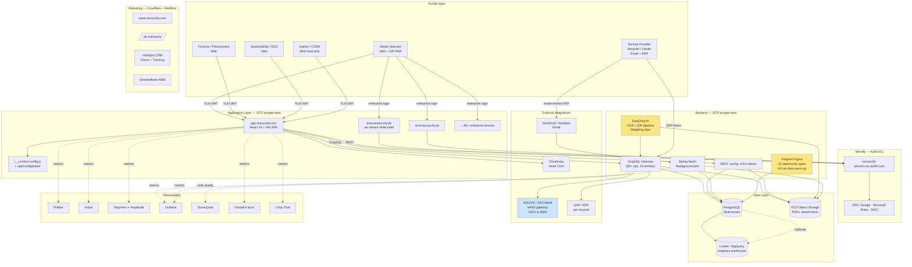

# Resourcify.com — ULTIMATE Intelligence Report

**Udarbejdet:** 28. maj 2026
**Formål:** Internt strategi- og teknisk fundament for at bygge konkurrerende SaaS-platform
**Metodisk grundlag:** 100% passiv recon (public DNS, certificate transparency, HTML/JS/JSON public assets, jobopslag, presseomtale). Ingen auth-omgåelse, ingen brute-force. Alle artefakter offentligt tilgængelige.
**Output-mappe:** `C:\Users\Ambro2\resourcify-analysis\`
**Søsterdokumenter:** `REPORT.md` (basis-arkitektur), `marketing-crawl.md` (28 sider), `feature-inventory.md` (komplet feature-katalog), `business-intel.md` (funding + konkurrenter)

---

## TL;DR

Resourcify er en **DACH-baseret B2B SaaS** som via en **two-sided marketplace mellem affaldsproducenter og 800+ recyclers** styrer **€100M+ værdi i affaldsstrømme** for kunder som Hornbach, BMW, McDonald's, Maersk, J&J, Bosch og Fraport. De har rejst **~€23M total** (€14M Series A i Sep 2023 ledet af Vorwerk Ventures), har strategisk 5% ejet af **Interzero**, og kører på **React 19 + Vite + GraphQL + Java/Spring Boot på GCP** med Auth0, multi-tenant white-label, og en moden DevOps-stack (Grafana, Looker, SonarQube, per-PR previews).

**Det er ikke deres tech der er deres moat — det er deres data og recycler-netværk.** Tech er kompetent men ikke unik. Den reelle barriere mod entry er: (1) compliance-djungel (CSRD, ESRS E5, EANV, EPR), (2) recycler-netværket man har bygget over 8 år, og (3) enterprise sales-cyklusser. En ny aktør kan vinde ved at angribe **én vertical (healthcare anbefales)** med dybere compliance + bedre AI + open API.

---

# Del 1: Komplet Tech-Stack

## 1.1 Frontend (`app.resourcify.com`)

| Lag | Teknologi | Bevis |
|-----|-----------|-------|
| **Framework** | React 19.2.4 | Bundle indeholder react.dev URLs, hooks, hydration |
| **Bundler** | Vite | Asset-hash-pattern, `VITE_*` env-prefix |
| **Sprog** | TypeScript | Komponentnavne med korrekt PascalCase, Zod-skemaer |
| **Routing** | React Router | Confirmed (2 sig + path-patterns) |
| **State** | Redux Toolkit + Immer | 10+ redux refs, immer mutations |
| **GraphQL klient** | Sandsynligvis **urql eller graphql-request med codegen** | `relay` ref + `gql` tag + ingen Apollo Client signaturer |
| **Forms / Validation** | **Zod** (260 matches, dominant) + Yup (16, legacy) | Migration in progress |
| **UI base** | **Radix UI + shadcn-style components** | `@radix` ref, AlertDialog, command palette |
| **UI utilities** | cmdk, vaul, sonner | Command palette, drawer, toast |
| **Rich text** | **Slate** (252 matches) | Heavy editor usage |
| **Charts** | **Recharts** (108) + **D3** (424) | Dashboard-heavy |
| **Virtualization** | virtua | Large list performance |
| **Date** | date-fns | Modern Date library |
| **PDF generation** | jsPDF | Client-side PDF export |
| **Excel export** | xlsx (SheetJS) | Multi-place usage |
| **i18n** | i18next | Confirmed + JSON locale files |
| **Mock for dev** | MSW (Mock Service Worker) | DevX/test environment |

## 1.2 Auth & Identity

| Komponent | Teknologi |
|-----------|-----------|
| **Identity Provider** | **Auth0** (EU tenant: `resourcify-phoenix.eu.auth0.com`) |
| **SDK** | `@auth0/auth0-react v2.12.0` |
| **Custom domains pr. miljø** | `login.app.{dev,staging,prod}.resourcify.com` |
| **Supporterede SSO-leverandører** | Google, **Microsoft (Entra ID)**, generisk OIDC |
| **App-side authentication flow** | Authorization Code + PKCE (code_challenge_method=S256) |
| **Tokens** | OpenID Connect (`openid profile email read:profile offline_access`) |
| **Public config endpoint** | `GET /api/config/public` returner Auth0 client/domain/audience |

## 1.3 Backend (formodet — bekræftet fra jobopslag + DNS)

| Komponent | Teknologi |
|-----------|-----------|
| **Sprog/runtime** | **Java** (eksplicit i jobopslag) |
| **Framework** | Spring Boot (idiomatisk antagelse + Swagger spotted på `swagger.dev.mcd.resourcify.de`) |
| **API-stil** | **GraphQL** (primær) + REST for `/api/config/public` |
| **API-dokumentation** | Swagger/OpenAPI for legacy REST |
| **Machine-to-machine API** | Confirmed via `/admin/m2m-clients` route + `m2m-clients` GraphQL ops |
| **Database** | Sandsynligvis **PostgreSQL** (Cloud SQL på GCP) — multi-tenant schema-or-RLS |
| **Background jobs** | Sandsynligvis Spring Batch (route `/batches/:batchId/processing` afslører batch UI) |
| **Hosting** | **Google Cloud Platform**, europe-west region (A-record 34.89.196.1) |

## 1.4 Observability & Analytics

| Funktion | Værktøj | Bevis |
|----------|---------|-------|
| Error tracking | **Rollbar** | Bundle (10 matches) |
| Session replay | **Hotjar** | Bundle + `static.hotjar.com` |
| Product analytics | **Segment** (router) + **Amplitude** (sink) | Bundle (6 + 1 matches) |
| Onboarding/tours | **Userpilot** | Token visible, SDK from `js.userpilot.io` |
| Live chat | **Crisp** | Bundle (1 ref) |
| Metrics/dashboards | **Grafana** (prod + dev clusters) | DNS: `grafana.cloud.resourcify.com` |
| Code quality | **SonarQube** | DNS: `sonarqube.dev.cloud.resourcify.com` |
| BI / SQL analytics | **Looker** | DNS: `looker.resourcify.com` |

## 1.5 Asset-, Email- & DevOps-infra

| Funktion | Værktøj |
|----------|---------|
| Image CDN | **Cloudinary** (`cdn.resourcify.de`) |
| App build assets | `resourcify-app.com` (separat domæne) |
| Marketing CDN | **Webflow CDN** (`cdn.prod.website-files.com`) + Cloudflare |
| Email afsender | `email.resourcify.com` (formentlig SendGrid eller HubSpot) |
| Marketing redirect | `go.resourcify.com` (HubSpot CTA-domæne) |
| Per-PR previews | `*.pr.resourcify.com` |
| Branch previews | `*.preview.resourcify.com` |
| HubSpot file hosting | `4641157.fs1.hubspotusercontent-eu1.net` |

## 1.6 Compliance & GDPR

| Funktion | Værktøj |
|----------|---------|
| App consent | **ConsentManager.net** (ID 171152) |
| Marketing consent | **Cookiebot** (ID `53d4a2f1-df6e-4442-af51-c2ebd9f73aa6`) — separate platform! |
| Help center | **HubSpot Knowledge Base** (DE redirect til EN) |
| HR / recruiting | **Teamtailor** |
| Specialized compliance | **NSUITE** (3rd party for eANV/ZKS-Abfall integration) |

## 1.7 Marketing-stack (`www.resourcify.com`)

| Funktion | Værktøj |
|----------|---------|
| CMS | **Webflow** |
| Edge / WAF | **Cloudflare** |
| Forms | HubSpot Forms + `hubspotonwebflow.com` integration |
| CRM/tracking | **HubSpot** (account 4641157) |
| ABM / intent data | **Demandbase** |
| Visitor identification | **Sharp Ingenuity / Apollo** |
| Webflow utils | **Finsweet Attributes** |
| jQuery | 3.5.1 (Webflow default) |

---

# Del 2: Komplet Arkitektur

## 2.1 Multi-Tenant Model

Resourcify kører **to parallelle tenant-modeller** — det er deres mest interessante arkitektur-valg:

### A. Shared SaaS — `app.resourcify.com`
Standard B2B SaaS hvor alle SMB/mid-market-kunder logger ind på samme app. Tenant-isolation håndteres backend-side via:
- Auth0 Organizations
- JWT-claims der bærer `tenant_id`
- PostgreSQL row-level security ELLER schema-per-tenant

### B. Dedicated White-Label Enterprise — `<kunde>.resourcify.de`
Store kunder får:
- Egen produktion: `bmw.demo.enterprise.resourcify.de`, `karl-storz.resourcify.de`, `mcd.resourcify.de`
- Eget demo-miljø: `<kunde>.demo.enterprise.resourcify.de`
- Eget dev-miljø: `dev.<kunde>.enterprise.resourcify.de`
- Eget API-endpoint (selective): fx `api.mcd.resourcify.de` for McDonald's

### Tenant-hierarki (fra feature-inventory):
```
Mandant (tenant root)
  └─ Company (juridisk enhed)
        └─ Standort (location, fx en fabrik)
              └─ Anfahrtstelle (delivery point, fx en specifik dock)
                    └─ Container (fysisk container)

Cross-cutting:
  Kostenstellen / Profitcenter / Markierungen (custom tags)
```

## 2.2 Domain-Topologi (komplet kort fra CT-logs)

**Produktionsdomæner:**
- `resourcify.com` / `.de` / `.online` (tre TLDs)
- `app.resourcify.com` — shared SaaS
- `enterprise.resourcify.de` — enterprise hovedplatform
- `<kunde>.resourcify.de` — per-kunde production

**Miljøer:**
- `*.staging.resourcify.com` — staging
- `*.dev.resourcify.com` — udvikling
- `*.preview.resourcify.com` — branch-preview
- `*.pr.resourcify.com` — per-PR ephemerals
- `livedemo.resourcify.com` — sales demos

**Moduler/produkter (DNS afslører):**
| Subdomain | Produkt |
|-----------|---------|
| `closeloop.*.resourcify.com` | Closed-loop / take-back-system |
| `customerportal.resourcify.com` | Slut-kunde selvbetjening |
| `wms.dev.resourcify.com` | Waste Management System (kerneprodukt) |
| `wms-lite.dev.resourcify.com` | Letvægts-WMS |
| `exchange.resourcify.de` | B2B marketplace for genbrugsmaterialer |
| `qr.resourcify.de` | QR-scanning af containere |
| `eanv.demo.enterprise.resourcify.de` | Tysk e-affaldsregister-integration |
| `accounting.resourcify.de` | Faktura/regnskab |
| `discovra.dev.resourcify.com` | Nyt produkt under udvikling |
| `xs2r.demo.resourcify.de` | Exchange-to-Recycling-bro |
| `nsuite.resourcify.de` | 3rd-party NSUITE-integration (compliance) |
| `handbook.resourcify.de` | Intern/ekstern handbook |

## 2.3 Arkitektur-diagram



---

# Del 3: Komplet GraphQL API-Skema

Bundle-analysen afslørede **60+ GraphQL operations og 19 entity fragments**. Dette er essentielt deres komplette data-model:

## 3.1 Entity Model (Fragments)

| Fragment | On Type | Formål |
|----------|---------|--------|
| `CompanyFields` / `CompanyDetailFields` | Company | Kundefirma |
| `LocationFields` / `LocationBasicFields` | Location | Fysisk site |
| `LocationLabelFields` | LocationLabel | Tags på locations |
| `ContainerTypeFields` | ContainerType | Type af affaldscontainer |
| `ContainerTypeCategoryFields` | ContainerTypeCategory | Container-kategorier |
| `WasteTypeFields` | WasteType | Affaldstype (AVV-kode) |
| `DerivedMaterialFields` | DerivedMaterial | Bagvedliggende materiale |
| `RecyclingRouteFields` | RecyclingRoute | Genbrugsvej (disposal path) |
| `EmissionFactorFields` | EmissionFactor | CO2-faktor pr. materiale/metode |
| `ServiceOrderFields` | ServiceOrder | Bestilling (pickup/delivery/exchange) |
| `ServiceOrderListItemFields` | ServiceOrderListItem | Listevisning af order |
| `ServiceExecutionFields` | ServiceExecution | Faktisk udført service |
| `TenantFields` | Tenant | Tenant config |
| `TableReportFields` | TableReport | Tabel-baseret report |
| `TimeSeriesReportFields` / `TimeSeriesDataPointFields` | TimeSeriesReport | Tidsserie-data |
| `SeriesMetadataFields` / `SeriesValueFields` | Series | Generisk serie-data |
| `PageInfoFields` | PageInfo | Cursor pagination |

## 3.2 Operations (komplet liste)

### Lookups (autocomplete)
`AdminLookupContainerTypes`, `AdminLookupLocations`, `AdminLookupWasteTypes`, `LookupCompanies`, `LookupContainerTypeCategories`, `LookupContainerTypes`, `LookupLocationLabels`, `LookupLocations`, `LookupServiceOrders`, `LookupWasteCatalog`, `LookupWasteTypeCategories`, `LookupWasteTypes`

### CRUD — Container Types
`ContainerType`, `ContainerTypes`, `GetContainerTypeCategories`, `CreateContainerType`, `UpdateContainerType`

### CRUD — Locations
`Location`, `Locations`, `CreateLocation`, `UpdateLocation`, **`MergeLocations`** *(masterdata-kvalitet!)*

### CRUD — Companies
`GetCompany`, `GetCompanies`, `CreateCompany`, `UpdateCompany`, **`MergeCompanies`**

### CRUD — Waste Types
`WasteType`, `WasteTypes`, `CreateWasteType`, `UpdateWasteType`, **`MergeWasteTypes`**, `WasteCodeSustainabilityDefaults`, `WasteTypeCatalogCodes`

### Service Orders (det operationelle hjerte)
`GetServiceOrder`, `GetServiceOrdersList`, `UpdateServiceOrder`, `UpdateServiceExecution`, `DeleteServiceOrders`

### Contracts
`GetContract`, `GetContracts`, `UpsertContract`

### Tenant / Users / Roles
`GetTenant`, `UpdateTenantSettings`, `UpdateMe`, `AvailableRoles`, `AvailablePermissions`, `CreateSystemRole`, `UpdateSystemRole`, `DeleteSystemRole`

### Dashboards / Reporting
`HomeDashboardKpis`, `HomeDashboardCircularityReport`, `HomeDashboardRecyclingRate`, `TopPerformance`, `RecyclingRateOverTime`, `CostOverTime`, `CostHeatmap`, `CostPerLocationTable`, `WasteVolumeProgression`, `WasteBalanceTable`, `SeparationRateKpis`, `SeparationRateOverTime`, `SeparationRateFractions`

### CSRD / Compliance reporting
`CsrdMaterialsBreakdown`, `CsrdReportTable`, `OperationsServicesAtLocation`

### CO2 / Emission Factors
`SetEmissionFactors`, `RemoveEmissionFactors`

### Disposal Path Management
`SetDisposalPathAllocations`, `SetDisposalPathLocationOverrides`, `RemoveDisposalPathAllocations`

### Meta
`IntrospectionQuery` (standard GraphQL introspection)

---

# Del 4: Komplet Feature-Katalog

## 4.1 Routes / Sider (komplet fra bundle)

```
/                                Home dashboard
/access-denied                   Permission error page
/callback                        Auth0 callback
/invite                          User invitation acceptance
/discover                        AI-discovery feature
/insights                        Optimization Insights (12 opportunity types)
/operations                      Daily operations (services list)
/orders                          Service orders list + filters
/locations                       Locations master
/companies                       Companies master
/contracts                       Contracts master
/service-providers               Recycler / hauler directory
/service-provider-locations      Provider locations
/waste-catalogue                 Master AVV waste codes
/waste-materials                 Derived materials taxonomy
/waste-report                    Periodic report generator
/container-types                 Container master
/container-type-categories       Container categories
/reporting                       Compliance & cost reports
/cost                            Cost dashboards
/csrd                            CSRD reporting module
/separation                      Separation rate analysis
/recycling-rate-definition       Configure recycling-rate formula
/organization                    Tenant settings
/users                           User management
/roles                           Role management
/settings                        App settings
/profile                         User profile
/upload                          File upload (manual data)
/batches/:batchId/processing     Batch processing UI
/admin/tenants                   Super-admin: tenant management
/admin/roles                     Super-admin: role definitions
/admin/m2m-clients               Super-admin: M2M API clients (B2B integrations!)
```

## 4.2 Optimization Insights — De 12 AI-Drevne Anbefalingstyper

Direkte fra i18n-filerne. Hver opportunity har: navn, beskrivelse, kategori (savings/circularity/benchmarking), prioritet (high/med/low), årlig besparelse, CO2-impact, actions-knap.

| Opportunity | Kategori | Beskrivelse |
|-------------|----------|-------------|
| **Container efficiency** | Savings | Optimize container sizes and pickup frequencies |
| **Price benchmarking** | Benchmarking | Match all locations to your best internal price |
| **Recycler comparison** | Benchmarking | Switch volume to the best-priced recycler per material |
| **Recycling pathway upgrades** | Circularity | Upgrade streams to higher-value recycling routes |
| **Sorting improvement** | Circularity | Reduce mixed waste through better source separation |
| **Waste overproduction** | Circularity | Reduce output at locations above peer median |
| **Circular economy programs** | Circularity | Join certified programs matching your waste streams |
| **Equipment right-sizing** | Savings | Downsize compactors/presses below threshold use |
| **Service contract review** | Savings | Audit contract terms against current market rates |
| **Pickup window optimization** | Savings | Cluster pickups across sites to reduce trip count |
| **Compactor density tuning** | Savings | Increase compaction ratio on under-tuned units |
| **Hauler fee audit** | Savings | Audit ancillary fees against contracted rate cards |

**Mest interessant:** Insights kræver "4-6 ugers data" før resultater vises (lyses op fra "Calibrating"-status). Det betyder de bygger en **data-moat**: jo længere kunder bruger systemet, jo bedre AI.

## 4.3 Operative Features (fra help-center-deep-dive)

### Master Data
- **Container × Article model** med template-IDs (`A150102ABS10`-pattern = AVV-kode × type × størrelse)
- Referential integrity der forhindrer destruktive deletes
- "Sammelartikel" (mixed-waste-containere)
- Bulk via Excel-export → edit → re-import
- Merge-operations for Locations/Companies/Waste Types (master-data hygiejne)

### Operations Flow
- **Standortübersicht** (location overview) som primær operator-UI
- Per-container scheduling — to modes:
  - "Auf Abruf" (on-demand "+")
  - "Intervall" (auto-create 6 dage før næste pickup)
- "Mehrmengen" (overflow quantities) og "nachträgliche Erfassung" (retroactive entry)

### Order State Machine (9 states)
```
Beauftragt → Bestätigt → Ausgeführt → Zurückgemeldet
  → Geprüft → Bereit zur Abrechnung → In Abrechnung → Abgerechnet
  (+ Storniert som side-state)
```

### Order Types
1. **Gestellung** (delivery of new container)
2. **Leerung** (empty existing container)
3. **Tausch** (swap)
4. **Abholung** (final pickup)

### Provider Communication
- Dual channel: auto-email to disposal provider ELLER direct ERP integration
- Per-provider email-routing-regler
- **Inbound mailbox pr. tenant** — auto-link executions/invoices to orders ("Eingehende E-Mails" inbox)

### EasyDrop AI — Intelligent Document Processing
- Drag-and-drop PDF weighing slips
- AI extracts weight + qty
- Auto-populate orders, auto-status til "Geprüft"
- In-app feedback loop til kontinuerligt at forbedre modellen
- **Højeste-friktion feature at klone** — kræver IDP-pipeline + træningsdata

### 5-Stage Invoice Matching
- Excel companion to PDF invoice
- Internal stable IDs: `RMID`, `RCID`
- Multi-criteria scoring
- Highest match rate selection
- "Schattenpositionen" (shadow positions) som billing source-of-truth

### Plausibility Check
- Per-article min/max weight range
- In-range = auto-Geprüft
- Out-of-range = auto-problem-ticket

### Pricing Engine
- Tagespreis (daily) / Pauschalpreis (lump) / Mietpreis (rental, auto-generated) / Index-linked
- Manually-maintained monthly index (KILDE TIL DIFFERENTIERING: auto-feed via EUWID, plasticker, EEX)

### Contract Conditions
- Drive selectable lead-time windows per article × kunde × provider

### Multi-Tenancy & RBAC
- Hierarki: Mandant > Company > Standort > Anfahrtstelle
- Cross-cutting: Kostenstellen, Profitcenter, Markierungen
- Roller: ADMIN (tenant-wide) vs USER (location-scoped)
- Multi-role per user, fine-grained scoping

## 4.4 Reporting & Analytics

### Standard KPI-bibliotek (deres definitioner)
- **Recyclingquote** (Recycling rate)
- **Getrenntsammlungsquote** (Separation rate) — explicit AVV-liste med ~60 numerator-koder, 5 mixed denominators, ekskluderer hazardous & unverified
- **Rückmeldequote** (Reporting rate)
- **Problemquote** (Problem rate)
- **Pünktliche Abholquote** (On-time pickup rate)
- **Auftragsausführungsquote** (Order execution rate)

### Dashboards
- Home Dashboard (KPI cards + Circularity report + Recycling rate)
- Insights (12 opportunities)
- Cost dashboards (CostOverTime, CostHeatmap, CostPerLocation)
- Waste Balance Table
- Top Performance ranking
- CSRD Materials Breakdown + Report Table
- Material analysis med **boxplots** (cost & CO2 per material, absolute + per-tonne)
- Location benchmarking (multi-site ranking)
- Operations Dashboard (real-time: punctuality, problem rate, execution rate, report-back rate)

### CO2 Engine
- **GHG Protocol Scope 3 Cat. 5 aligned**
- Formula: `Σ(mass × method_factor)`
- Factor-sources: ADEME, Genesis, UK gov, Ecoinvent
- **Self-admits approximation** — ingen "avoided emissions" endnu
- **OPEN COMPETITIVE WEDGE**: ISO-14064-certificering eller verificerede faktorer

### Estimated Weight Calculator
Fallback-chain for vægt:
1. Historical average (først)
2. Else: density × volume × 70% fill
3. Tag på data lineage: hvilken metode blev brugt (reported / hist-est / density-est / converted / missing)

## 4.5 Compliance Module

### CSRD / ESRS E5 (EU sustainability reporting)
- One-click CSRD compliance for byggeri/manufacturing
- Scope-3 extraction
- ESRS E5 mapping
- Materials breakdown report
- Hazardous-waste documentation with electronic signatures (construction-page)

### EANV — Tysk Hazardous Waste
- **Outsourced til NSUITE** (3rd party, runs via `nsuite.resourcify.de`)
- OSCI to ZKS-Abfall, BMU interfaces
- Sync hvert minut
- Begleitscheine, Entsorgungsnachweise, Übernahmescheine
- Automatisk Abfallregister
- Disposal-certificate utilization gauge med thresholds (warning ved 70%)
- **Card-reader QES** via Windows-side "NSUITE-Signatur" .exe
- *No cloud signing, no mobile signing* — **klar konkurrent-åbning: remote QES, eIDAS-cloud**

### Healthcare-specific
- eANV automation for hospitaler
- Medical-supplier take-back programs
- Take-back for medical equipment

### Airport-specific
- Cost/tonne KPI
- CSRD-aligned recycling rate targets per material stream

## 4.6 QR & Mobile

- QR-code workflow: generér ≤10 koder pr. PDF batch
- Mobile-scan åbner ordering fra job-site
- **PWA/browser, IKKE native app** — klar konkurrent-åbning
- Operator-side: Standortübersicht-UI på tablet/mobile-web

## 4.7 Materialer & Affaldstyper (fra i18n-enums)

**Materialer:** Construction, Plastic, Chemical, Wood, Paper, Textile, Metal, Glass, Electronic, Medical, Other

**Container-typer:** ROLL_OFF, DOCUMENTS, SKIP, LARGE_BIN, PLASTIC_DRUM, PRESS_CONTAINER, HAZARDOUS, PALLET_CAGE, BIG_BAG, PALLET, METAL_DRUM, BALE, LOOSE_COLLECTION, DIRECT_LOADING, OTHER

**Disposal Methods:** RECYCLING, THERMAL_RECOVERY, INCINERATION_WITHOUT_ENERGY_RECOVERY, LANDFILL, REUSE, OTHERS

**Industries:** Manufacturing, Construction, Retail, Hospitals/Clinics, Airports

---

# Del 5: Business Intelligence

## 5.1 Selskab

- **Resourcify GmbH**, Hamburg (HQ), Berlin, München
- Grundlagt: **2015**
- Mission: "Operating System for a circular future"
- Stiftere: **Gary Lewis (CEO)**, **Felix Heinricy (CBDO/MD)**, **Pascal Alich** *(co-founder, status uvis)*
- CCO: **Angeley Mullins**
- Hjemmemarked: DACH, ekspanderer til EU + UK

## 5.2 Funding History (korrekt)

| Round | Date | Amount | Lead | Co-investors |
|-------|------|--------|------|--------------|
| Pre-seed/seed | 2018-2021 | Unknown | — | — |
| Series A-I | Feb 2022 | **€5M** | — | — |
| Strategic | Jul 2023 | (5% stake) | **Interzero** | — |
| Series A-III | Sep 2023 | **€14M** ($15.1M) | **Vorwerk Ventures** | Revent, Ananda, Speedinvest, BonVenture, WEPA, Interzero |
| **Total raised** | — | **~€23M / $25.4M** | | |

Stated use of funds: international expansion (UK + EU), AI investments, growth team.

## 5.3 Customer Base (bekræftede + sandsynlige)

**Press-bekræftede:**
McDonald's, Hornbach, Johnson & Johnson, Bosch/Syntegon, Fraport, REWE/Penny, Five Guys, OBI, Rolls-Royce, Interzero (joint venture).

**Synlige via CT-logs (egne subdomæner — aktive eller POC):**
BMW, Continental, Stihl, Schaltbau, Stoeber, Struktol, ABL Technic, Flachglas, Karl Storz, Arthrex, Ambu, Dräger, Helios, Paracelsus, SRH, University Hospital Bonn, LVR, Paracelsus-Kliniken, Bonava, Vonovia, Zech, Maersk, HAVI, MV Werften, Belfor, ENM, Repop, Laborchemie Apolda, HCH Umwelt, Bauhaus, Edeka, Aldi (Nord+Süd), Rewe, Penny, Toom, Eurobaustoff.

**Headline metrics (selv-rapporteret):**
- 2M+ devices
- 25k+ locations
- 800+ recyclers
- 19+ countries
- 100M+ tonnes managed
- €100M+ waste under management (€200M+ inkl. Interzero JV)
- Hornbach: 33,000 orders automated år 1
- Syntegon: 2/3 reduktion i tid på waste mgmt

## 5.4 Awards

- German Innovation Award 2023 (Excellence B2B – IT)
- Circularity Award 2023 (Sustainability Kongress)
- Handelsblatt Spark Award 2023 (finalist)

## 5.5 Go-to-Market

- **Pricing**: Fuldt gated. Eneste public statement: "Platform starter: monthly cost + cost per pickup."
- **Estimeret ACV**: €80-150k
- **Sales-cyklus**: 6-12 måneder (enterprise)
- **Motion**: Sales-led, ingen self-serve, ingen free trial
- **Demo split**: "Book a Demo" (waste mgmt) vs "Book a Consultation" (circularity/take-back)
- **Channel strategy**:
  1. Two-sided marketplace (waste-generators ↔ 800+ recyclers)
  2. Wholesale/white-label via Interzero's customer base
  3. OEM/integration: OTTO DÖRNER GO portal (built with marketoolz.com, first customer Belfor), Interzero "Zero Waste Manager" JV
- **Lead intake**: HubSpot Forms → demo-call (1-2 business-day SLA)
- **Inbound funnel-stack**: HubSpot + Demandbase + Apollo (visitor identification) + Userpilot (post-signup)

## 5.6 Content Strategi

- Blog: ~1 post/måned, primær forfatter Madeline Sinclair
- Categories: Circular Economy, Recycling, Sustainability, Waste Management, Zero-Waste
- 13+ gated PDFs (CSRD checklists, ROI guide, Scope 1/2/3 cheat sheet, Single-Use Devices, retail/manufacturing industry guides, Sustainability Index Report 2023)
- Heavy physical events: IFAT 2024 (booth A-324), Circulaze, Circular Republic Festival, EUROBAUSTOFF, BME

---

# Del 6: Konkurrent-Landskab

| Konkurrent | HQ | Funding | Differentiator vs Resourcify | Trussel-niveau |
|------------|-----|---------|------------------------------|-----------------|
| **AMCS Group** | Ireland | $225M+ | Operator-side ERP (haulers, recyclers), kæmpe install base | **HIGH** — kan move opstrøms til waste-generators |
| **Routeware** | US/UK | $123M+ | Collection routing, M&A-roll-up i US | MEDIUM (geografi) |
| **Circulor** | UK | $69M | Battery/EV traceability, blockchain | MEDIUM (vertikal) |
| **Sourcemap** | US | $5M+ | Supply chain transparency + circularity | LOW-MEDIUM |
| **Evreka** | Turkey | $5M+ | Strong in EM, mobile-first | LOW (geografi) |
| **Topolytics** | UK | $5M | ML-heavy waste analytics, lighter feature set | LOW |
| **Wastedge** | Australia | Privately held | Operations-focused | LOW (geografi) |
| **Rubicon** | US | Public (delisted) | Marketplace model | LOW (US-fokus) |
| **EcoVadis** | France | $980M | Sustainability ratings (adjacent, NOT direct) | LOW |
| **CircularIQ** | Netherlands | <$5M | Material flows | LOW |
| **Seenons** (FLAG) | Netherlands | €10M+ | **Eneste ægte EU direct peer** — samme buyer, samme geografi, lignende funding | **HIGH** |

**Direkte konkurrent-truslen kommer i denne rækkefølge:**
1. **AMCS** — hvis de bygger en waste-generator-portal oven på deres ERP-base, har de kunderne i forvejen
2. **Seenons** — nemmest at gå hovedet mod hovedet
3. **Circulor** — hvis de bevæger sig fra battery til generel industrial waste

---

# Del 7: Replikations-Roadmap — 12 Ugers MVP

Hvis I skal bygge en konkurrerende platform internt, her er en konkret build-plan baseret på alt ovenstående. Antagelse: 2 fullstack-ingeniører + 1 designer + 1 PM/founder.

## Uge 1-2: Foundation

| Track | Output |
|-------|--------|
| **Infra** | GCP project, Cloud Run, Cloud SQL Postgres, GCS, Cloud Build → GitHub Actions, Cloudflare front |
| **Auth** | Auth0 EU eller Clerk; SSO support for Google + Microsoft Entra fra dag 1 |
| **Multi-tenant routing** | Wildcard DNS `*.dit-firma.com` → load balancer; Host-header tenant routing i backend |
| **Frontend skeleton** | Vite + React 19 + TS + Tailwind v4 + shadcn/ui + React Router 7 |
| **Backend skeleton** | Spring Boot 3 + Spring Security + Spring Data JPA + Spring GraphQL **eller** TypeScript + Hono + Prisma + GraphQL Yoga (anbefales for hurtigere DX) |
| **GraphQL codegen** | GraphQL Code Generator → TypeScript types client-side |
| **CI/CD** | GitHub Actions + per-PR preview via Cloud Run revisions |

## Uge 3-4: Core Master Data + RBAC

| Track | Output |
|-------|--------|
| **Schema** | Tenants → Companies → Locations → Anfahrtstellen + ContainerTypes + WasteTypes (AVV-codes) + ServiceProviders |
| **GraphQL ops** | CRUD + Lookup + Merge operations for hver entity (mirror deres 60+ ops) |
| **RBAC** | Roles (ADMIN/USER) + Permissions + Scopes (tenant/company/location) |
| **Excel I/O** | xlsx for bulk export/import af master data |
| **Audit log** | Postgres-based event log for compliance |

## Uge 5-6: Operations Flow

| Track | Output |
|-------|--------|
| **ServiceOrders** | Komplet 9-state machine, 4 order types |
| **Standortübersicht UI** | Tablet-friendly per-location overview med per-container scheduling |
| **Scheduling** | "Auf Abruf" + "Intervall" modes med background job (Spring Batch eller node-cron) |
| **Provider notification** | Email-engine (SendGrid eller Postmark) + per-provider routing rules |
| **Inbound mailbox** | IMAP eller AWS SES inbound + auto-link to orders |
| **QR generation** | jsPDF + qrcode-lib → ≤10 QR codes per PDF |

## Uge 7-8: Reporting & Insights v1

| Track | Output |
|-------|--------|
| **Dashboards** | Home (KPI cards), Operations (real-time KPIs), Cost (heatmap + over-time), Waste Balance |
| **Charts** | Recharts + D3, identical pattern til Resourcify |
| **Standard KPIs** | Recyclingquote, Getrenntsammlungsquote, Rückmeldequote, Problemquote, Pünktliche Abholquote |
| **CO2 engine v1** | GHG Scope 3 Cat. 5: `Σ(mass × factor)`. Faktor-tabel fra ADEME (åbent) |
| **Reports export** | CSV + Excel + PDF (jsPDF) |
| **Insights skeleton** | 3-4 af de 12 opportunity-typer (start med Container Efficiency, Price Benchmarking, Pickup Window Optimization, Hauler Fee Audit) |

## Uge 9-10: AI Wedge — EasyDrop Equivalent

**Dette er DET feature der bedst differentierer:**

| Track | Output |
|-------|--------|
| **PDF upload UI** | Drag-and-drop + batch upload |
| **OCR pipeline** | **Google Document AI** eller **Azure Form Recognizer** (begge har waste-specific templates) |
| **Field extraction** | Weight, quantity, date, container ID, AVV code |
| **Auto-link** | Match til pending ServiceOrder via location + container + date heuristic |
| **Feedback loop** | UI for user-correction → train-data export → re-train monthly |
| **Confidence scoring** | < threshold → manual review; > threshold → auto-Geprüft |

**Stack-anbefaling:** Brug **Google Document AI** (de er på GCP alligevel) — kan trænes på custom waste-slip templates. Alternativt **Anthropic Claude med vision** for zero-shot extraction (billigere upstart, ingen training).

## Uge 11-12: Compliance v1 + Polish

| Track | Output |
|-------|--------|
| **CSRD module** | Materials Breakdown Report + Scope 3 mapping |
| **eANV** | Start med **integration via NSUITE eller Zedal** (samme 3rd party route som Resourcify) — byg ikke selv fra scratch |
| **Observability** | Sentry (frontend + backend), Hotjar, Segment → PostHog (cheaper than Amplitude) |
| **Onboarding** | Userpilot ELLER Intro.js (self-hosted, gratis) |
| **Live chat** | Crisp (matching deres) eller Intercom (mere modent) |
| **Mobile PWA** | Service worker, offline cache for Standortübersicht, native camera API for QR |

## Out of MVP — Phase 2 (uge 13-24)

- M2M API endpoints + API key management (skal være BEDRE end Resourcifys gated approach)
- Native mobile app (iOS + Android — Resourcify har KUN PWA, klar differentiator)
- **Cloud QES** (remote eIDAS signature) — Resourcify er stuck på Windows-exe
- Auto-price-feed via EUWID / EEX / plasticker — Resourcify opdaterer manuelt
- BI integration: dbt + BigQuery + Metabase (i stedet for Looker — billigere)
- Real-time collaboration (Liveblocks) på reports
- Multi-currency for international ekspansion

---

# Del 8: Konkurrence-Wedges — Hvor Resourcify Er Sårbare

Identificeret fra deres svagheder. Disse er hver især en mulig "wedge"-strategi:

## Wedge 1: Healthcare Vertical (ANBEFALET STÆRKEST)

**Hvorfor:** Resourcify har 6+ healthcare-kunder (Karl Storz, J&J, Helios, Paracelsus, Dräger, Ambu, Arthrex, University Hospital Bonn) — men behandler healthcare som "bare en vertikal" uden dedikeret regulatory-produkt.

**Healthcare har:**
- Højeste fines for non-compliance
- Længste kontrakter
- Højeste pricing power
- Stærk compliance-overlay (medisinsk affald, ATA-tilbagetagelse, GMP-cleanout)

**Hvad du bygger:**
- ISO 14971 / IEC 62304 compliance built-in
- Medical Device Regulation (MDR) reverse-logistics workflow
- Sterilizable container management
- Drug recall-integration
- Hospital-specific KPIs (kg waste per discharged patient)

**Time-to-traction:** 6-9 måneder for første referencekunde (start med en mellemstor regional hospitalskæde).

## Wedge 2: Open API + Developer-First

**Hvorfor:** Resourcify har M2M-API men gated, ingen public docs (kun Swagger på dev-McDonald's-tenant), ingen developer portal.

**Hvad du bygger:**
- Full REST + GraphQL public API
- Developer portal med live API explorer (Stoplight eller Postman)
- npm/pip-pakker for de største ERP'er (SAP, Dynamics, NetSuite)
- Webhook-engine for real-time events
- Open-source connector library

**Time-to-traction:** Lang men sticky — vinder developer-mindshare og PLG.

## Wedge 3: Cloud-baseret QES (Qualified Electronic Signature)

**Hvorfor:** Resourcify kræver Windows-side .exe ("NSUITE-Signatur") for at signere EANV-dokumenter. Det er en stor pain for moderne kontorer (Mac-brugere, mobile, remote work).

**Hvad du bygger:**
- eIDAS-cloud QES via D-TRUST eller Bundesdruckerei
- Mobile QES via PassYou eller Klarna-style identity
- Audit-trail blockchain (optionel, men sales-narrative)

**Time-to-traction:** 3-4 måneder. Direkte kopi-trumf mod Resourcify.

## Wedge 4: Realtime Price Feeds

**Hvorfor:** Resourcify opdaterer indekspriser manuelt månedligt — det er pinligt for et data-firma.

**Hvad du bygger:**
- Live feed fra EUWID, plasticker, EEX, LME
- Automatic contract-repricing
- AI-driven "best time to sell" recommendations

**Time-to-traction:** 2-3 måneder.

## Wedge 5: Verificeret CO2-engine

**Hvorfor:** Resourcify selv-indrømmer at deres CO2-faktorer er approximate, og de har ingen ISO 14064 verification.

**Hvad du bygger:**
- ISO 14064-verified factors (via TÜV, DNV eller Bureau Veritas)
- Avoided-emissions modeling (Resourcify mangler)
- Third-party audit-ready PDF reports
- Watermarking på Scope 3-claims

**Time-to-traction:** 6 måneder + audit-omkostning (~€50-100k).

---

# Del 9: Estimerede Omkostninger

## 9.1 Build (12 uger MVP)

| Post | Omkostning |
|------|-----------|
| 2 fullstack-ingeniører × 3 mdr × €10k/md | €60.000 |
| 1 designer × 3 mdr × €8k/md | €24.000 |
| 1 PM/founder × 3 mdr × €0 (founder time) | €0 |
| Auth0 starter eller Clerk Pro | €600 |
| GCP infra (small) | €600 |
| Tooling (GitHub, Linear, Vercel, etc.) | €600 |
| Domain + SSL | €100 |
| **Total MVP** | **~€86.000** |

## 9.2 Drift (12 mdr efter MVP, 10 kunder)

| Service | Pris/md |
|---------|---------|
| GCP (Cloud Run + Cloud SQL HA + GCS) | €700 |
| Auth0 Professional (1000 MAU) | €240 |
| Cloudinary Advanced | €200 |
| Cloudflare Pro | €25 |
| Sentry Team | €30 |
| Grafana Cloud Pro | €60 |
| HubSpot Sales Hub Pro | €450 |
| Userpilot Growth | €350 |
| Cookiebot | €30 |
| GitHub Team + Actions | €40 |
| Domain CDN/email | €30 |
| Google Document AI (EasyDrop) | €200 (varies) |
| **Total drift/md** | **~€2.355/md** |

**Per-tenant marginal cost ved 100 tenants:** €25/md ≈ €300/år. Med €80k ACV = 99.6% bruttomargin pr. tenant.

## 9.3 GTM (12 mdr)

| Post | Omkostning |
|------|-----------|
| 2 enterprise sales reps × €100k OTE | €200.000 |
| 1 marketing lead | €80.000 |
| Field events (IFAT, Circulaze) | €40.000 |
| HubSpot + Demandbase + tools | €20.000 |
| **Total GTM år 1** | **~€340.000** |

---

# Del 10: Strategisk Konklusion

## 10.1 Hvad Resourcify gør rigtigt

1. **Two-sided marketplace** med 800+ recyclers er deres reelle moat — vanskeligt at kopiere
2. **Multi-tenant white-label** er teknisk elegant og giver retail-fleksibilitet
3. **CSRD/ESRS-positionering** som thought-leader rammer perfekt på timing (EU lov)
4. **HubSpot + Demandbase + Apollo** GTM-stack er top-tier for enterprise B2B
5. **GraphQL + React 19 + Vite** moderne frontend giver hastighed
6. **Per-PR previews + SonarQube + Grafana** moden DevOps

## 10.2 Hvad Resourcify gør forkert (jeres muligheder)

| Svaghed | Jeres vinkel |
|---------|-------------|
| Ingen native mobile app (kun PWA) | Native iOS + Android dag 1 |
| Windows-side QES exe | Cloud QES |
| Manuelt indeks-prisfeed | Real-time fra EUWID/EEX |
| Gated API, ingen developer portal | Open API + dev-portal |
| CO2-faktorer approximate | ISO 14064-verified |
| Ingen SAP/DATEV connector | Pre-built ERP-pakker |
| Healthcare som "bare en vertikal" | Healthcare-first SKU |
| Insights kræver 4-6 ugers data | Synthetic benchmark fra dag 1 |
| To consent-platforme (rod) | Én moderne (Usercentrics) |
| Ingen MFA dokumenteret | MFA + WebAuthn baseline |
| Stripe IKKE i stack | Self-serve tier med Stripe |

## 10.3 Anbefalet vinkel for jer

Baseret på alt: gå efter **Wedge 1 (Healthcare) + Wedge 3 (Cloud QES) + Wedge 2 (Open API)** i kombination.

- Healthcare giver dybeste pricing-power og længste kontrakter
- Cloud QES er en direkte øjeblikkelig differentiator
- Open API giver developer-mindshare og kan vinde over tid

**Year 1 mål:** 3-5 healthcare-kunder (ARR €300-500k), platform working end-to-end, ISO 14064 certificering i gang.

**Year 2 mål:** 15-20 kunder, expand beyond healthcare til pharma + medical devices, integrere første ERP-pakker.

**Year 3 (matching Resourcify's Series A):** €5M ARR, 50+ kunder, Series A ~€10-15M på 5-7x ARR multiple.

---

# Del 11: Appendiks — Råfiler i denne analyse

```
C:\Users\Ambro2\resourcify-analysis\
├── REPORT.md                    Original arkitektur-rapport (v1)
├── ULTIMATE-REPORT.md           Denne rapport (v2)
├── marketing-crawl.md           28-side marketing-deep-crawl
├── feature-inventory.md         Komplet feature-katalog fra help-center
├── business-intel.md            Funding + investors + konkurrenter
├── raw/
│   ├── index-ydVlX6_5.js        3.6 MB minified React-bundle (downloaded)
│   ├── index-CNWTlDOu.css       158 KB CSS bundle
│   ├── __runtime-config.js      68 B Vite runtime config
│   ├── public                   Auth0 config response
│   ├── en-US.json               88 KB komplet engelsk i18n
│   ├── de-DE.json               96 KB komplet tysk i18n
│   ├── app-login-network.txt    22 network requests fra login
│   └── marketing-network.txt    Marketing-side 3rd-party stack
└── screenshots/
    ├── app-login.png            Auth0 login page
    └── marketing-home.jpg       Marketing homepage
```

---

# Del 12: Næste Skridt (Foreslået Rækkefølge)

1. **Beslut wedge** — Healthcare vs Open API vs QES vs kombination. Jeg foreslår healthcare først.
2. **Lock target customer** — find 3-5 mellemstore tyske/EU-hospitaler at pilot-sælge mod
3. **Bygge 4-ugers spike** — multi-tenant routing + Auth0 + GraphQL skelet + Vite-frontend
4. **Hire eller engage** — 1 senior fullstack + 1 designer; PM = jer
5. **Apply for German EXIST funding** (€137k for tysk startup) eller EIC Accelerator
6. **Compete-watching**: sæt Google Alerts på "Resourcify", "Seenons", "AMCS Group"

---

**Slut på rapport. Spørg hvis du vil dykke dybere i en specifik del.**
